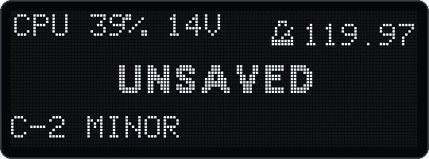
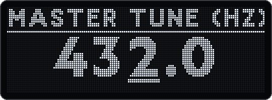
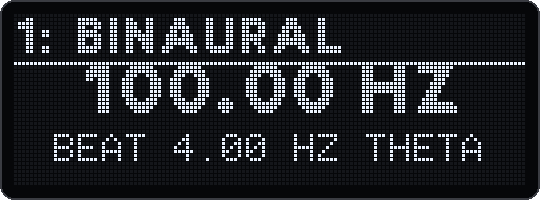
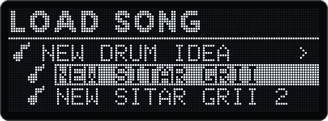
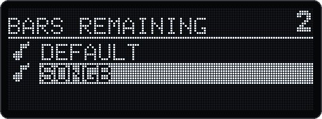
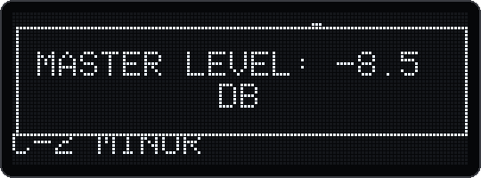
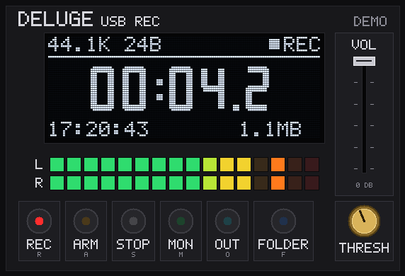
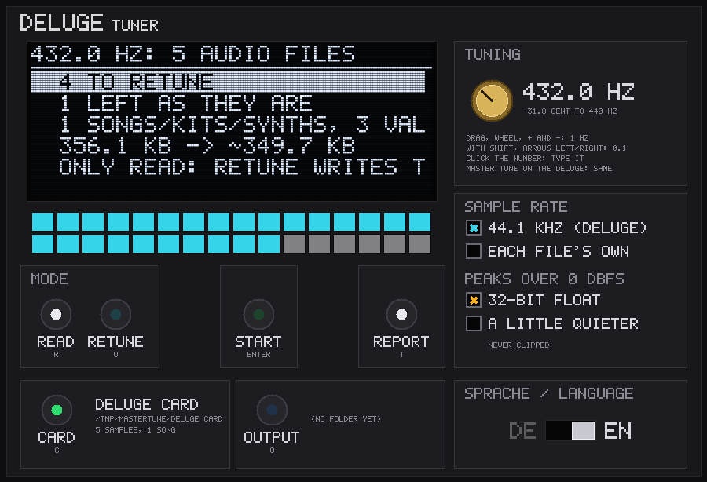
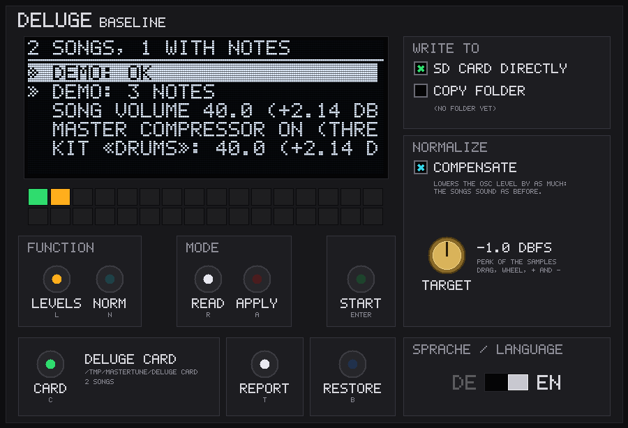

# Deluge 1.2.1 with Master Tune

## In short

**mastertune** is my fork of the official Deluge community firmware **1.2.1**: lighter on the CPU, with a CPU monitor, the Deluge as a USB audio interface, a master tune and a few tools around it. Latest: **v18.3**, [`deluge-1.2.1-mastertune-v18.3-l2d-3581f019.bin`](https://github.com/Giansn/deluge/raw/claude/wizardly-brahmagupta-nnrk07/mastertune-1.2.1/deluge-1.2.1-mastertune-v18.3-l2d-3581f019.bin). Install it like any Deluge firmware: the .bin in the SD card's root folder (only one .bin there), then switch the Deluge on while holding SHIFT. Every version, the details and the measurements are further down.

**Written with Claude (AI).** This is a personal fork, not a contribution to the official firmware: please don't report its bugs to the community developers, report them in this repository's [issues](https://github.com/Giansn/deluge/issues). Every change is tested in an emulator that runs the firmware's real ARM code (below), but **v18.x has not been played on a real Deluge yet.** Keep a copy of your card.

| | |
|:-:|:-:|
|  |  |
| CPU monitor: load and voices in one line | Master tune, here 432.0 Hz |
|  |  |
| Frequency drone: a binaural tone | Song browser: a song's versions under one name |
|  |  |
| Song-change countdown | Volume in 0.5 dB steps, shown in dB |

<sub>The OLED of the real v18.3 firmware, run in the emulator (`mastertune-1.2.1/tests/screenshots`).</sub>

**Lighter on the CPU**
- **About 20–25% less CPU work per sample than stock 1.2.1**, measured the same way for both in the emulator on three songs. At moderate load the audio routine's time can roughly halve, because a scheduling bug from 1.2.1 is fixed; near full load that advantage disappears. In a full-load test song 32 voices stay on average instead of 20 before any are cut. Method, numbers and caveats: [`tests/vs121/README.md`](mastertune-1.2.1/tests/vs121/README.md).
- Silent tracks skipped, L2 cache for code and data, smarter sample streaming, a RAM saver for kits.

**CPU monitor**
- One line on the OLED, e.g. `CPU 39% 14V`: the load and the sounding voices, plus `QL` while the Deluge lowers its quality and a blinking `VC` while it cuts voices. The Alerts mode shows only those.
- Hold LEARN and press TEMPO to switch it on or off, in any view. It stays as it is after a restart.

**USB audio interface**
- The Deluge shows up on the computer as a stereo audio input next to MIDI: 24 bit, 44.1 kHz, no driver, bit-exact. Switch it on in Settings → Community features → USB audio. DelugeRec (below) records it.

**Tuning**
- **Master tune** from 415.3 to 466.2 Hz in 0.1 Hz steps (Settings → Tuning → Master tune), for example 432 Hz. Everything that sounds follows: synths, kits, samples, FM and DX7, audio clips (time-stretched, the tempo stays), held notes, CV outputs and external MIDI gear (RPN 1 fine tuning). Recordings remember the tuning they were made in, so they are never tuned twice.

**Sound**
- **Filters** (v18–v18.3): no rustle at low cutoff, cutoff and resonance glide sample by sample (no zipper), mode and routing changes without clicks, Drive with 2× oversampling where 1.2.1 had it.
- **EQ and volume:** real shelving EQ, volume in 0.5 dB steps shown in dB, an optional output limiter and filter crossing guard.
- **Reverb:** a new Digital model, Mutable and Freeverb repaired, HPF and LPF, no wobble. **Delay:** clean repeats, no clicks or pitch jumps when the time changes (Fade or Tape), LPF and HPF in the feedback.
- **Frequency drone:** up to 16 tones, binaural, monaural or isochronic, tempo sync, sidechain, Life, FM and Pulse; drone tracks in song and arranger view.
- **Arpeggiator from 1.3** with latch, ratchet bounce and ping-pong.

**Workflow and fixes**
- Song-change countdown, song browser with versions, readable firmware version, OLED brightness, flicker-free pad dimming, SD card over USB (DEx, deluge-editor).
- Fixed: sidechain click, crackle when saving, clock outputs under external clock, USB MIDI receive, section launch by CC, settings of other versions lost on saving, the song's reverb sidechain sync level slipping at every save.

**Tools for Windows** (one .exe each, nothing to install; Windows asks once because they are not signed: More info, Run anyway)

| | |
|---|---|
|  | **DelugeRec** ([download v7](https://github.com/Giansn/deluge/releases/download/deluge-rec-v7/DelugeRec-v7.exe)): records the Deluge's USB audio with a monitor on the headphones. Each take is named after the song, the date and the firmware. |
|  | **DelugeTuner** ([download v2](https://github.com/Giansn/deluge/releases/download/deluge-tuner-v2/DelugeTuner-v2.exe)): retunes a card's sample library once to the master tune. The samples then play as they are instead of being resampled in every voice. |
|  | **DelugeBaseline** ([download v4](https://github.com/Giansn/deluge/releases/download/deluge-baseline-v4/DelugeBaseline-v4.exe)): checks the levels of all songs on a card and evens them out, with a backup. |

The newest version of each tool is always in its release: [deluge-rec](https://github.com/Giansn/deluge/releases/tag/deluge-rec), [deluge-tuner](https://github.com/Giansn/deluge/releases/tag/deluge-tuner), [deluge-baseline](https://github.com/Giansn/deluge/releases/tag/deluge-baseline). As Python scripts they are in `mastertune-1.2.1/tools/`.

**Tested:** every release is built twice with the same SHA-256. The firmware's own ARM code runs in an emulator: it boots, loads songs, renders audio and goes through hundreds of checks and stress tests. The emulator is not the hardware, though: timing, the SD card and USB can still behave differently on a real Deluge.

**Source:** `mastertune-1.2.1/patches/0001`–`0116` against `release_1_2_1`, plus `mastertune-1.2.1/l2test/0001`–`0003` for the L2 build.

## All versions

All files named below are in the folder [`mastertune-1.2.1/`](mastertune-1.2.1/): the firmware `.bin` files, `patches/`, `tools/`, `tests/`, `docs/` and the rest.

This is the official community firmware **1.2.1** (tag `release_1_2_1`, commit `c23bc2fe`) with an adjustable master tuning, in several stages. v5 adds the arpeggiator from 1.3, v6 a second bounce version, v7 access to the SD card over USB, v8 the Deluge as a USB audio input on the computer, v9 smarter sample streaming and a RAM saver for kits, v10 a better reverb, v11 a better delay and no more crackle when saving, v12 a frequency drone with up to 16 tones, v13 more performance, a ping-pong arp, flicker-free pad dimming, more precise MIDI and a reworked drone, v14 a reverb without wobble, a delay without pitch jumps and a countdown on song change, v15 a living drone (Life, FM, Pulse), a CPU monitor in one line and three fixes from the community, v16 drone tracks for song and arranger view and a profiler, v17 half the load, a song browser with expandable versions, a shortcut for the CPU monitor and the L2 cache in the main file, v18 filters without rustle and with clean transitions, volume controls in dB and a readable OLED, v18.2 filters, EQ and volume without leftovers after a silence, v18.3 Drive with oversampling as in 1.2.1 and settings that are kept when saving.

| File | Version (Settings → Firmware version) | Contents |
|---|---|---|
| `deluge-1.2.1-mastertune-49e71650.bin` | `1.2.1-mastertune-49e71650` (v2) | Master Tune |
| `deluge-1.2.1-mastertune-v3-09dcce01.bin` | `1.2.1-mastertune-v3-09dcce01` | v2 + performance package A + sidechain fix |
| `deluge-1.2.1-mastertune-v4-6cb344e2.bin` | `1.2.1-mastertune-v4-6cb344e2` | v3 + performance package B |
| `deluge-1.2.1-mastertune-v5-5daddd9f.bin` | `1.2.1-mastertune-v5-5daddd9f` | v4 + arpeggiator from 1.3, latch, ratchet bounce |
| `deluge-1.2.1-mastertune-v6-1e1af07a.bin` | `1.2.1-mastertune-v6-1e1af07a` | v5 + second bounce version: fixed ratchet count, bounce without getting quieter |
| `deluge-1.2.1-mastertune-v7-ca0b5bd7.bin` | `1.2.1-mastertune-v7-ca0b5bd7` | v6 + SD card over USB for DEx and deluge-editor |
| `deluge-1.2.1-mastertune-v8-76c5a9b8.bin` | `1.2.1-mastertune-v8-76c5a9b8` | v7 + USB audio: the Deluge's output as a recording input on the computer |
| `deluge-1.2.1-mastertune-v9-c0212731.bin` | `1.2.1-mastertune-v9-c0212731` | v8 + smarter sample streaming, Kit RAM saver |
| `deluge-1.2.1-mastertune-v10-7f9ad5c1.bin` | `1.2.1-mastertune-v10-7f9ad5c1` | v9 + reverb: new Digital model, Mutable and Freeverb repaired, HPF and LPF |
| `deluge-1.2.1-mastertune-v11-dc37f26a.bin` | `1.2.1-mastertune-v11-dc37f26a` | v10 + delay: clean repeats, no clicks on time changes, LPF and HPF in the feedback; no crackle when saving |
| `deluge-1.2.1-mastertune-v12-f89b478c.bin` | `1.2.1-mastertune-v12-f89b478c` | v11 + frequency drone: 16 tones, binaural, monaural, isochronic, tempo sync, sidechain, its own view |
| `deluge-1.2.1-mastertune-v13-9b861a5c.bin` | `1.2.1-mastertune-v13-9b861a5c` | v12-perf + drone polish, ping-pong arp, flicker-free dimming, faster saving, more precise MIDI, CPU monitor in words |
| `deluge-1.2.1-mastertune-v14-c1d1c8bb.bin` | `1.2.1-mastertune-v14-c1d1c8bb` | v13 + reverb without wobble (modulation, pre-delay), delay without pitch jumps, countdown on song change, two fixes for the card |
| `deluge-1.2.1-mastertune-v15-b5f5c900.bin` | `1.2.1-mastertune-v15-b5f5c900` | v14 + living drone (Life, FM, Pulse), CPU monitor in one line, section launch by CC, USB MIDI without packet loss, clock outputs under external clock |
| `deluge-1.2.1-mastertune-v16-c610417f.bin` | `1.2.1-mastertune-v16-c610417f` | v15 + drone tracks (drones as kit tracks in song and arranger view, Hz lane per row), profiler, USB audio stays on after a restart |
| `deluge-1.2.1-mastertune-v17-l2d-b3385d83.bin` | `1.2.1-mastertune-v17-l2d-b3385d83` | v16 + half the load (scheduling, minimum window, silent tracks), song browser, CPU monitor shortcut, drone view without hangs, quieter HPF whistle; **with L2 cache for code and data** |
| `deluge-1.2.1-mastertune-v17-2cb5e31b.bin` | `1.2.1-mastertune-v17-2cb5e31b` | the same without L2 cache, for switching back |
| `deluge-1.2.1-mastertune-v18-l2d-6fa0875b.bin` | `1.2.1-mastertune-v18-l2d` (from v18 on without hash) | v17 + filters without rustle, transitions without steps and clicks, volume in 0.5 dB steps, EQ with real shelves, Output limiter, Filter crossing guard, OLED brightness, song name for DelugeRec; **with L2 cache for code and data** |
| `deluge-1.2.1-mastertune-v18-124aeaa2.bin` | `1.2.1-mastertune-v18` | the same without L2 cache, for switching back |
| `deluge-1.2.1-mastertune-v18.2-l2d-c9c65066.bin` | `1.2.1-mastertune-v18.2-l2d` | v18 + filters, EQ and volume after a silence fixed; **with L2 cache for code and data**, only in this variant |
| `deluge-1.2.1-mastertune-v18.3-l2d-3581f019.bin` | `1.2.1-mastertune-v18.3-l2d` | v18.2 + Drive oversampled like 1.2.1 (no cut voices in Drive-heavy songs), unknown settings and the reverb sidechain's sync level are kept; **with L2 cache for code and data**, only in this variant |

SHA-256: v2 `05b457a0…d2ce7e0cb`, v3 `7858013f…35d4d73`, v4 `cc9127a0…61128209`, v5 `65607a5d…c745251b`, v6 `83974fd2…617ef692`, v7 `48c55bae…f9581a21`, v8 `6cfda14b…99441298`, v9 `032898cf…7c673745`, v10 `1b4ac767…46e8a6ac62`, v11 `e4d1062e…10c9a0ad`, v12 `97288329…5e7360ac`, v13 `9ff41174…7c4c50e7`, v14 `cb17bbb3…8e23e6e5`, v15 `cdce07f3…da7ca652`, v16 `7eed1a77…71897f9f`, v17-l2d `aad4d080…5ec32c4b`, v17 without L2 `ae6aedd4…be88ae64`, v18-l2d `03f55664…75098a8c`, v18 without L2 `ea2d606a…220d434f`, v18.2-l2d `7f45090c…0f8c29ef`, v18.3-l2d `f41f5639…8d8af97a` (in full: `sha256sum *.bin`).
Rechecked on 2026-09-26: every version v2–v12 was rebuilt from scratch from its commit in a separate working copy, with 441–448 recompiled files. Every SHA-256 matches the released file.
Source code: `patches/0001` to `0116` against `release_1_2_1`. v2 = 0001, v3 = 0001–0003, v4 = 0001–0004, v5 = 0001–0005, v6 = 0001–0006, v7 = 0001–0007, v8 = 0001–0008, v9 = 0001–0009, v10 = 0001–0010, v11 = 0001–0011, v12 = 0001–0012, v13 = 0001–0028 (0013–0015 are the performance version v12-perf, the same as `perf/0001`–`0003`), v14 = 0001–0035, v15 = 0001–0041, v16 = 0001–0055, v17 without L2 = 0001–0074, the main file v17-l2d adds `l2test/0001`–`0003`, v18 without L2 = 0001–0112, the main file v18-l2d likewise adds `l2test/0001`–`0003`, v18.2-l2d = 0001–0113 and `l2test/0001`–`0003`, v18.3-l2d = 0001–0116 and `l2test/0001`–`0003`.

## v3 and v4: Differences

| | v3 | v4 |
|---|---|---|
| Sinc interpolation with NEON buffer shift: every retuned, transposed or time-stretched sample voice without a cache hit about 40% cheaper | yes | yes |
| Menu: shorter wait times for UI tasks, no swallowed encoder detents in the sound editor (up to 5 per poll, as before with SHIFT) | yes | yes |
| Sidechain fix: no more click when ducking, the reverb return also follows smoothly | yes | yes |
| Culling like the current community firmware: less often, fewer voices, half of them faded out instead of cut | no | yes |
| Silent kits and audio tracks without time-dependent effects skip their effects chain | no | yes |
| The volume stage writes directly into the mix (one pass fewer), no double zeroing | no | yes |
| Sound in normal operation | bit-identical to v2, except for the sidechain fix (click-free instead of a jump) | like v3; under overload a different, softer culling response |

**Performance package A (v3):**
- **NEON buffer shift:** The 16-entry interpolation buffer is shifted with NEON instructions instead of value by value. That was about half of the sinc cost.
- **Tested:** On real Cortex-A9 machine code in the emulator it gives the same buffers for all shift widths (`tests/run_neon_shift_test.py`).
- **Rejected:** Two additional compiler flags (`-funswitch-loops -fsplit-loops`) changed the floating-point code in 81 functions, including audio. That made bit-identity unprovable, so they are not included.

**Sidechain fix (v3, v4):**
- **Bug:** The volume ramp per buffer started at the new value and ran past it by the whole change. With ducking of more than 6 dB within one buffer, the gain even flipped negative, i.e. to inverted polarity.
- **Now:** The ramp runs from the old to the new value. The bug is also in the current community firmware.

**Performance package B (v4):**
- **Gain:** It is smaller than with A. By estimate it saves 0.2–0.6% CPU per silent kit or audio track and around 0.05% per playing sound through the saved pass.
- **Culling:** The main benefit is the new culling: under load fewer notes are cut, and in return the risk of clicks rises slightly under real sustained overload.
- **Skipped effects chain:** It only applies when mod FX, delay, stutter, sample rate reduction, saturation and compressor are off, no recording is running and the chain has output exactly zero for 4096 samples. The result is then silence again.

## v5: Arpeggiator from 1.3, plus Latch and Ratchet Bounce

v5 contains everything from v4 plus the complete arpeggiator of community firmware 1.3. The menus stay in the familiar 1.2.1 style (one list, no horizontal menu). New items sit where they belong by topic.

| Feature | Where | What it does |
|---|---|---|
| **Kit arpeggiator** | Kit with Affect Entire pressed → menu → Kit arpeggiator | Plays a kit's rows like the notes of a chord (Up, Down, Random, Walk, Pattern …). Can be switched off per row with "Include in kit arp". |
| **Arp for MIDI and gate rows** | Select the row → menu | Until now there was only a warning LED there. Now: its own arp and randomizer, shortcut column 11 as on MIDI tracks. |
| **Preset** with new **Walk** | Arpeggiator → Preset | Now also in the list, not only on the pad. |
| **Latch** (new, not in 1.3) | Arpeggiator → Latch | The arp keeps playing after you let go. The next note played after releasing all keys replaces the notes without the arp falling out of time. Switching it off stops the held notes. |
| **Step Repeat** | Arpeggiator → Step repeat | Each step is repeated 1–8 times. |
| **Note modes** Walk 1–3, Pattern | Arpeggiator → Note mode | Walk: randomly one step forward or back. Pattern: a random but repeating order (re-roll by selecting it again). |
| **Chord Simulator** | Kit row → Arpeggiator | A drum row plays a chord (5th, sus2, minor, major, sus4, m7, 7, maj7). |
| **Ratchet Bounce** (new, not in 1.3) | Arpeggiator → Ratchet bounce, −10 … +10 | The hits of a ratchet like a bouncing ball: positive values get faster and quieter, negative ones slower and louder, 0 = even as before. Example +6 with 8 hits: onsets at 0/32/54/70/81/88/94/97% of the step, volume 100 → 29%. |
| **Randomizer** | its own menu right after Arpeggiator | Lock (repeatable randomness over 16 steps), gate, octave and velocity spread, chord polyphony and probability, probabilities for note, swap, bass, glide and reverse. |
| **Reverse probability** | Randomizer | Single arp notes play their sample backwards. Unlike in 1.3 this applies per voice, so notes sounding at the same time do not reverse each other. |
| **Automation** | Automation view, Select encoder | All new arp parameters of synths and kit rows, for the kit (Affect Entire) also those of the kit arp. |

**Files:**
- **1.2.1 songs and presets** load unchanged, including MIDI and CV tracks with arp settings.
- **Stock 1.2.1** loads v5 files. It skips new entries (kit arp, randomizer, latch, bounce) and loses them at the next save. Walk and Pattern modes become Up there.
- **Internal parameter numbers** now match those of 1.3. This only affects which parameter is preselected in automation view when an old song is first opened. Values, automations, mod knob and MIDI learn assignments are saved by name and are not affected.

**Not adopted:**
- **Pad shortcuts from 1.3 in column 15** (velocity spread, Lock, Note Probability): in 1.2.1 these pads are used for patching.
- **MIDI Follow CCs for arp parameters:** 1.2.1 maps MIDI Follow by the pad grid; adopting them would have shifted existing assignments.

**Tested:**
- **Build:** no errors or warnings in the arp code.
- **Two separate code reviews** (engine and menus):
  - Two real bugs found and fixed: with an unsynced arp and strong bounce, a last ratchet hit that came too late delayed the next step. And a synth without a clip could crash on a note (the same bug is in 1.3).
  - One cross-check of the fixes.
- **Not tested on the device.**

## v6: Second bounce version

v6 contains v5 unchanged and two new settings in the arpeggiator menu, right next to Ratchet Bounce. With the defaults (Auto, fade on) v6 behaves exactly like v5, also when loading songs.

| Setting | Values | What it does |
|---|---|---|
| **Ratchet notes** | Auto, 2 … 8 | **Auto** as in 1.3 and v5: randomly 2, 4 or 8 notes, weighted by "Number of ratchets". **2 … 8:** always exactly that many. Whether a step ratchets is then decided only by the ratchet probability. At sync 1/128 and 1/256 at most 2, at 1/64 at most 4: otherwise the gaps would be hardly longer than an audio block (2.9 ms). |
| **Bounce fade** | on, off | **On** as in v5: as the gaps get shorter, the hits get quieter, like a ball. **Off:** all hits keep their velocity. |

Even ratchets now divide the step by the number of notes. For 2, 4 and 8 this gives exactly the same times as before.

**Tested:** build without warnings, two builds with identical SHA-256, one code review. It confirmed that the defaults run exactly like v5 and found no bugs in the new paths. **Not tested on the device.**

**Rebuilding the figure from "You Are The Seeds"** (see `references/pettra-arp/ANALYSIS.md`):

| Setting | Value |
|---|---|
| Tempo | 138 |
| Arp Sync | 1/8 |
| Ratchet notes | 3 |
| Ratchet bounce | +6 |
| Bounce fade | off |
| Ratchet probability | in automation view only on the eighth before the beat where the figure should come, otherwise 0 |

That gives onsets at 0, 99 and 169 ms after the start of the eighth, i.e. gaps of 99, 70 and 49 ms. Measured in the track: 99, 64 and 46 ms at 0:57 and 102, 75 and 46 ms at 6:39.

## v7: SD card over USB

v7 contains v6 unchanged plus file access over USB MIDI from community firmware 1.3 (SysEx protocol "smSysex"). The card stays in the Deluge. With it, these run on the computer:

| App | What works |
|---|---|
| [DEx](https://dex.silicak.es) | File browser: view folders, upload and download files, rename, copy, move, delete, create folders. Plus, as before, display mirroring and screenshots. |
| [deluge-editor](https://cyface.github.io/deluge-editor/) | Open synth and kit presets directly from the card and save them back there. |

**How to use:** Connect the Deluge to the computer by USB, open the page in Chrome, Edge or Opera and allow MIDI access. The apps detect the file access by themselves.

**Adapted to 1.2.1** (otherwise as in 1.3):
- Only over USB. v7 ignores requests over the DIN sockets because 1.2.1 has no overflow protection there.
- The USB MIDI send buffer is four times as large as in 1.2.1 (12 instead of 3 KB). A reply only goes out as a whole, as soon as there is room for it. That way even a full folder page with long names fits, and deluge-editor sees every folder completely. In 1.2.1 a full buffer would have overwritten the oldest message not yet sent.
- v7 sends file names with characters outside ASCII (e.g. umlauts) escaped. That keeps the list readable instead of spoiling the whole reply.

**Limitations:**
- **deluge-editor shows "needs community 1.3.0 or later" in red,** because the Deluge honestly reports 1.2.1. The message is wrong here: opening and saving work anyway.
- **deluge-editor hides controls it only knows from 1.3 on.** These include the arp additions from v5/v6 (spread, chord, Walk, kit arp …). You set those on the Deluge. They are kept in the file when saving.
- **"Live Edit" in deluge-editor does not work.** It needs additional commands from a firmware fork that 1.3 does not have either.
- **Names with umlauts:** The apps show them wrongly and usually cannot open such files. Best use only names made of A–Z, 0–9 and _.
- **During playback** do not delete or overwrite samples the song currently needs. Large transfers are slow over MIDI; for whole sample collections a card reader is faster.
- **MIDI to the computer during transfers:** Notes and clock over USB share the send buffer with the replies and can therefore arrive late. Do not transfer files while playing with a DAW over USB. DIN MIDI is not affected.

**Tested:** host test (the firmware code on the PC with AddressSanitizer, on a FAT32 RAM disk, 40 checks in the flow of DEx and deluge-editor), build without warnings, two builds with identical SHA-256, one code review. It found three bugs, all fixed: truncated folder lists in deluge-editor, too short a wait for room in the send buffer, a missing safeguard when writing without a buffer. **Not tested on the device.**

## v8: USB audio, stage 1 (Deluge → computer)

v8 contains v7 unchanged. New: the Deluge can send its output signal to the computer over USB. It shows up there as an audio input (stereo, 24 bit, 44.1 kHz) next to the usual MIDI. The computer receives exactly what is at the Deluge's outputs: the same signal the Deluge records when resampling, with master volume and input monitoring.

**Switching it on:** Settings → Community features → **USB audio** (7-segment: `UAUD`) to on, **leave the menu with Back** and restart the Deluge (up to v15 the Deluge saves the setting only when you leave the menu, from v16 on immediately). The setting only takes effect at startup and only when the Deluge is connected to the computer as a USB device, not as a USB host. When it is off (default), the Deluge behaves exactly like v7.

**On the computer** (no driver, USB Audio Class 1.0):
- macOS: Audio MIDI Setup shows "Deluge" with 2 inputs.
- Windows: Settings → System → Sound → Input: "Deluge".
- Linux: `arecord -l` shows "Deluge".
- In the DAW, choose "Deluge" as the input and set the project to 44.1 kHz.

**Technical details:**
- The Deluge sets the clock (asynchronous endpoint): each USB packet contains 44 or 45 frames, depending on how full its buffer is. If its crystal drifts from the computer's clock, it compensates with one frame more or less, without a feedback channel and without resampling. The samples arrive bit-exact.
- Latency: about 6 ms buffer plus 1–2 ms USB.
- If the computer does not read for a while, the Deluge discards the stale buffer and starts again after 6 ms of silence. If the audio engine stalls, a short silence comes instead of crackles.
- The data stream runs in the USB interrupt over its own FIFO port. MIDI is not affected by it.

**Limitations:**
- **Not tested on the device.** It is the first version on this hardware; I need your feedback.
- Only 44.1 kHz. If the DAW runs at a different rate, the operating system resamples. In exclusive mode or with ASIO the project must be set to 44.1 kHz.
- With USB audio on, the computer sees the Deluge as a new device. The MIDI ports in the DAW may have to be reassigned.
- The Deluge controls the volume. The computer has no control for it.
- If the Deluge is not recognized with USB audio or hangs: unplug the USB cable, start it, switch the setting off.
- **"USB audio gap"** (7-segment: `UGAP`): The computer got an empty packet, i.e. a 1 ms gap in the recording. This can happen under very high load because the Deluge disables all interrupts while computing each track (the current community firmware does too). The message appears at most every 10 seconds. Please report when it comes.
- Stage 2 (computer → Deluge) follows as soon as stage 1 runs on the device.

**Tested:** descriptors against the rules of USB 2.0, USB Audio 1.0 and USB MIDI (64 checks). Buffer and packet control in a simulation over 10 minutes with clock deviations up to 1400 ppm, a computer that does not read for 200 ms, and a 20 ms engine stall (39 checks, with sanitizers). Build without warnings, two builds with identical SHA-256, one code review. It found two bugs, both fixed: MIDI receive over USB would have failed during streaming, and after interrupts had been disabled for a long time only one half of the double buffer would have been refilled.

## v9: Smarter sample streaming and a RAM saver for kits

v9 contains v8 unchanged and improves how the Deluge loads samples from the SD card. The card does not get faster, but its throughput goes where it is needed, and unused kit rows no longer hold fixed RAM.

1. **Loading by urgency (bug from 1.2.1 fixed).** The queue for load jobs had always sorted by memory address instead of priority. Now what a playing voice needs next comes first, then the starts of samples that may never play. **Effect:** fewer voices breaking off and fewer "card too slow" under load, for example when changing kits while playing.
2. **Double reserve when streaming.** A playing voice keeps three clusters ahead instead of two. The next block then has two cluster durations of time instead of one, with 32 KB clusters about 250–370 instead of 120–190 ms (stereo). Costs 32 KB per voice currently streaming.
3. **Short samples fully in RAM (bug from 1.2.1 fixed).** Samples of up to four clusters (up to 128 KB with 32 KB clusters) were meant to stay fully in memory. A calculation error instead held the first two clusters twice, and the rest could be evicted and reloaded.
4. **Kit RAM saver** (Settings → Community features → **Kit RAM saver**, 7-segment `KRAM`, on by default): Kit rows without notes in all of the song's clips release the held start of their samples, usually 64 KB per sample. For a kit with 50 samples of which the song uses 5, that is around 3 MB. The samples stay in the kit and in the cache until the RAM is needed elsewhere. When a row gets notes, the Deluge fetches its start back within one second. Excluded are kits with the kit arpeggiator or MIDI learn for the whole kit, and rows with their own MIDI learn, because they can play without notes too.
5. **No lost hits.** If a sample's start is not in RAM when the note is struck, the voice waits until it is loaded (usually a few milliseconds, at most 100 ms) and then plays from the beginning. In 1.2.1 the hit was dropped in such a case.

**Limitations:** Not tested on the device. When auditioning or playing a previously unused row over MIDI, the very first hit can come a few milliseconds late if its start has meanwhile been evicted from RAM. Sequenced notes are not affected, because rows with notes keep their starts. If you don't want that, switch the Kit RAM saver off.

**Tested:** the queue with the real firmware code on the PC (order, equal priorities, detection of the lowest priority), build without warnings, two builds with identical SHA-256, one code review. It found three bugs, all fixed: a waiting hit could stay silent because of the automatic release logic, the Kit RAM saver could write to freed memory when a preset was loaded into a kit row, and when unison was increased during the wait, the new voice took on a wrong state. In addition, a late entry into a sample (mute lifted in the middle of the note) and the switch from the cache back to the card now load with their voice's priority instead of the lowest.

## v10: Better-quality reverb

v10 contains v9 unchanged and reworks the song reverb: a new model, two repaired models and working filters. All settings are in the reverb menu as before (song and sound).

1. **New model "Digital"** (Model → Digital, 7-segment `DIGI`): Jon Dattorro's plate (1997), built like the Lexicon 224. Dense, smooth reverb without metallic ringing, because the modulation in the tank keeps shifting the resonances. Stereo from 14 taps, left and right uncorrelated.
   - **Time** (Room size): 0 ≈ 0.6 s, 30 (default) ≈ 4.5 s, 45 ≈ 18 s, 50 almost endless. **Width:** stereo width, 0 = mono. **Damping**, **HPF** and **LPF** as with Mutable.
   - As loud as Mutable (deviation at most 0.5 dB), so changing the model does not jump in volume.
   - The current community firmware has a model with this name, but with bugs: the modulated allpasses in the tank are not allpasses there (shorter, thinner reverb), both tank halves share one damping filter, and the plate is scaled 2.2 times too small. This version follows the paper.
2. **Mutable: modulation as in the original.** Because of a porting error, the two LFOs ran 16 times slower than at Mutable Instruments, so the reverb was almost static. Now they run as in the Rings, Elements and Clouds modules (about 0.45 and 0.28 Hz), and the "smearing" in the first diffuser is back. Songs with Mutable sound a bit more alive as a result; volume and length stay the same.
3. **Damping runs the right way round (Mutable).** In 1.2.1 damping ran backwards on the Mutable model: 0 and 50 were bright, 1 the darkest, with a jump between 0 and 1. Now as with Freeverb: 0 bright, 50 dark, stepless. **Existing songs sound the same**; only the displayed number is now 50 minus the old one (default 36 → 14). In the file the value is still stored as in 1.2.1, so songs stay interchangeable between the versions.
4. **HPF repaired.** Because of a calculation error it only reached 85 Hz instead of 540 Hz, and 1.2.1 did not apply it at all when loading a song. Now: 0 = 20 Hz, 25 = 190 Hz, 50 = 540 Hz, saved and loaded with the song. A value saved in old songs is loaded with the frequency it actually had back then (old 50 → new 12).
5. **New: LPF** (Mutable and Digital) to darken the whole reverb: 0 = 500 Hz, 25 = 3.2 kHz, 49 = 18.6 kHz, **50 = off** (default). Damping, by contrast, darkens the reverb tail more and more over time.
6. **Freeverb:** With width below the maximum, the right channel was louder, by 3.6 dB at width 0; now balanced (≤ 0.1 dB). And when a long, loud reverb exceeded the value range, the value wrapped around and clicked loudly. Now it is clipped. Otherwise Freeverb computes bit-identically as before.

**Limitations:**
- Not tested on the device.
- Digital needs about a third more CPU time than Mutable (computed once for the whole song).
- A song saved with Digital plays without reverb in 1.2.1, because 1.2.1 does not know the model.
- As before, HPF and LPF exist only for Mutable and Digital, not for Freeverb.
- v10 reads songs from community firmware 1.3 with their damping direction, because the community has since reversed damping too (2026-09-19). Older 1.3 songs cannot be told apart from those and come in with reversed damping, exactly as in the community firmware itself. This does not affect your songs from 1.2.1 and my versions.

**Tested:** host test with the firmware's reverb code (47 checks, with UndefinedBehaviorSanitizer): all models stable at maximum room size, reverb times and levels of Digital against Mutable, stereo balance and width, LFO rates, cutoff frequencies of HPF and LPF, conversion of all old damping and HPF values (identical sound). Build without warnings, two builds with identical SHA-256, one code review. It found two bugs, both fixed: the presets on the reverb button (Small, Medium, Large) would have become much darker with the new damping direction on the Mutable model, and songs from community firmware 1.3 would have been loaded with reversed damping.

## v11: Better-quality delay, no crackle when saving

v11 contains v10, reworks the delay (sounds, kits, audio tracks and song), and fixes the crackle when saving and a saving bug of the reverb from v10. The measurements come from a test with the firmware's delay code on the PC.

1. **Clean repeats after every time change (bug from 1.2.1 fixed).** The Deluge's delay spins its buffer faster or slower when the time changes. After that it should set up a new buffer and run lossless again. But if the new buffer was the same size as the old one, 1.2.1 rejected it. The delay then stayed in resampling mode for good, even if the knob was just moved briefly and turned back.
   - **Consequence in 1.2.1:** Every repeat lost 9 dB at 10 kHz and 24 dB at 15 kHz, which is why the echoes got dull so quickly.
   - **Now:** After a time change the repeats are bit-exact again.
2. **Resampling with a cubic kernel.** As long as the time changes or is modulated (LFO, envelope, automation), the delay writes and reads with a cubic kernel (Catmull-Rom), at any speed. 1.2.1 used triangles for this that were twice as wide as needed.
   - A repeat loses 0.6 dB instead of 6.9 dB at 10 kHz.
   - The resampling noise drops from −59 to −80 dB.
   - Very long delays (from about 4 s) keep −3.1 dB instead of −6.9 dB at 5 kHz.
   - Speed and feedback glide within an audio block instead of jumping every 2.9 ms. The buzz at 344 Hz drops from −78 to −103 dB.
3. **No clicks when changing the time.**
   - In 1.2.1 some of the write paths were one sample off, and the time jumped when switching between them. Now they all write to the same position. This makes the delay 1 sample (0.02 ms) longer.
   - 1.2.1 set up a new buffer of twice the size for every lengthening, however small. An LFO on the delay time therefore kept switching buffers, each time with a small jump. Now this only happens from 25% lengthening.
   - On a big jump in time the delay sets up a new buffer immediately. It now glides exactly like the old one it replaces; otherwise the time jumps when it takes over.

   Largest jump in the test, relative to a steady tone:
   - 5% shorter: 0.1× instead of 3.8×
   - 5% longer: 0.1× instead of 1.9×
   - 40% longer: 0.1× instead of 1.7×
   - 70% longer: 0.1× instead of 2.5×
   - less than half as long: 0.1× instead of 4.1×
   - sweeping across the base speed: 0.1× instead of 1.7×
   - LFO ±3% on the time: 0.1× instead of 1.7×
4. **Analog mode:** The saturation works with less aliasing (−18 instead of −14 dB of spurious content with heavily driven feedback), as already done for the compressor.
5. **New: LPF and HPF in the feedback** (delay menu, after Sync). Each repeat gets darker or thinner than the previous one, as with tape and bucket-brigade delays.
   - **LPF:** 0 = 500 Hz, 25 = 3.2 kHz, 49 = 18.6 kHz, 50 = off (default).
   - **HPF:** 0 = off (default), 1 = 25 Hz, 25 = 190 Hz, 50 = 540 Hz.
   - In Digital mode the delay only limits after the filters. That way the HPF stays within full scale even at full feedback.
   - They are saved with the sound, kit or song, but only when they are switched on.
6. **Two small bugs from 1.2.1 fixed:** A copied sound keeps triplet or dotted in its delay sync, and a newly starting delay begins without leftovers in the filter.
7. **No more crackle when saving (bug from 1.2.1 fixed).** While the Deluge assembles a song or a preset for the card, in 1.2.1 only the display kept running. The call to the audio engine was commented out at that point. The output therefore repeated its last buffer, which gave a short fart or crackle at every save. Now the audio engine keeps running during this too and loads the samples that are currently playing, just like when loading a song. This applies to songs, synth and kit presets and settings.

8. **Reverb damping saved correctly (bug from v10 fixed).** The darkest damping (50) of Mutable and Digital was saved on the Deluge as 0, i.e. as "no damping", and came back bright after loading. The firmware is built with `-funsafe-math-optimizations`, and with it the compiler turned the calculation into a comparison that rounded exactly this value wrongly. This did not happen on the PC. The reverb test in the Cortex-A9 emulator found it (see "Tests in the emulator").

**Limitations:**
- Not tested on the device, including the fix for saving.
- Delays over 2 s run in resampling mode as before, because their buffer cannot grow any larger.
- If the time is changed a lot in one go, the pitch of the repeats glides during one pass, like a tape slowing down. That is as in 1.2.1, only without the jump at the buffer switch.
- Resampling needs more CPU time, but only while the time changes or is modulated. Up to the base speed it is 4 weights per sample, above that more (8 at double speed), plus the cubic read interpolation. In normal operation the cost is the same as before.
- Saving takes a little longer, because the Deluge computes audio while doing it.

**Tested:**
- **Host test** with the firmware's delay code (24 checks, UndefinedBehaviorSanitizer aborts at the first error): repeats bit-exact after time changes, highs and noise under modulation, block staircases, jumps for seven kinds of time change, no new buffers for long delays, filter curves, headroom with HPF at full feedback, switching filters off without a jump.
- **Build:** without warnings, two builds with identical SHA-256.
- **Emulator:** All tests also run on the Cortex-A9 machine code (see "Tests in the emulator"). That is where the damping bug from v10 showed up.
- **Code reviews:** three, with a cross-check of every finding. They found six bugs in my changes, all fixed:
  - A new buffer clicked when taking over.
  - At full feedback the HPF overshot up to 1.84 times the limit.
  - A switched-off HPF kept its state. That later gave a click 175 times as steep as the tone.
  - Filter leftovers remained after a restart of the delay.
  - Unnecessary CPU time went into library calls.
  - When saving, streamed samples would have broken off without reloading.

## v12: Frequency drone

Detailed manual with quick start, all controls, menu, recipes and technical data: **`docs/Drone-manual.pdf`** (source: `docs/drone-manual.html`).

v12 contains v11 and adds a drone: up to 16 sustained tones, set in Hz or as a note, mixed under the music. Each tone can beat like in brainwave apps, pulse in the song's tempo and duck with the sidechain.

**Opening:** In song view press the **Scale** button, or choose **Drone** in the song menu of song view (press Select). **Back**, **Song** or **Scale** take you back to song view. In the arranger the menu item is missing, because the way back leads to song view.

**The drone view** is laid out like song view, with one tone per row instead of a clip:

| Element | Function |
|---|---|
| Rows | Tone 1 at the bottom, like clip 1 in song view. The Y encoder scrolls to tones 9–16. |
| Mute column | Tone on and off (green = on); its settings are kept |
| Audition column | Select a tone (white = selected) |
| Pads of a row | Level as a bar. Tapping a pad sets the level, in 16 steps. |
| Color | Mode: orange = tone, blue = binaural, turquoise = monaural, violet = isochronic. Beats up to 12 Hz pulse visibly. |
| Upper gold knob | Pitch. In Hz: 1 Hz per detent, 10 Hz when turned fast, 0.01 Hz with Shift. As a note: semitones, cents with Shift. |
| Press upper gold knob | switch between Hz and note; the pitch stays |
| Lower gold knob | Beat: 0.1 Hz per detent, 0.01 Hz with Shift. With tempo sync, the note value. |
| Press lower gold knob | Tempo sync on and off |
| Turn Select | Mode of the selected tone |
| Press Select | The tone's menu: mode, pitch as Hz or note, frequency, note, cent, beat, sync, timbre, level, pan. Plus the volume of the whole drone and the sidechain. |
| X encoder | Level, fine; pan with Shift |
| Play, Record, Tempo, Save, Load | as usual |

The OLED shows the tone, mode, pitch and the beat with its band (Delta, Theta, Alpha, Beta, Gamma). The 7-segment display shows the frequency with as many decimals as fit (55.25, 440.0, 1200), or the note. Beat, note value (16 for 1/16), level and pan appear there briefly while turning.

**Modes:**
- **Tone:** a steady sustained tone.
- **Binaural:** The left ear hears the frequency minus half the beat, the right ear plus half the beat. The beating arises in the head; this needs headphones.
- **Monaural:** Both tones sound in both ears; the beating is audible in the sound itself.
- **Isochronic:** The tone pulses on and off at the beat, with soft 6 ms edges.

**Timbres:** Sine (pure), Soft (harmonics 2–5, soft), Organ (octaves like drawbars), Rich (harmonics 2–8, sawtooth-like). They are band-limited: harmonics above 18 kHz are dropped so nothing aliases.

**Tempo sync:** The beat follows the song tempo, with note values from 1/1 to 1/64. At 120 BPM, 1/16 gives a beat of 8 Hz (Alpha). While the song is playing, the pulse locks to the grid, to within 1.2 ms in the test. This also holds with external MIDI clock (the drone follows it between the clock ticks) and with sync scaling, because tempo and position are counted as for the metronome.

**Pitch as a note:** Every tone can be set as a note with cents. It then follows the Master Tune (Settings → Tuning), like everything else in the Deluge. If the Master Tune is set to match an external instrument, for example a volca keys, the drone fits it.

**Level:**
- A tone at level 50 sits at −12 dBFS. Drone volume 50 corresponds to 0 dB; each step is 1 dB.
- The drone follows the song volume like the metronome. It is added after the song effects, so without song reverb and delay.
- It is missing from stem exports; it can be heard over USB audio.
- Many loud tones together can clip.

**Sidechain:** The drone ducks under the song's sidechain triggers, such as a kick with "Send to sidechain". Strength, shape, attack, release and sync are in the drone's sidechain menu. The level glides from sample to sample, as with the sidechain fix from v3, so nothing clicks.

The drone is **saved** with the song (tag `<drone>`), but only if it has been set up. Older firmware skips the tag. When another song is loaded or on Clear Song, the drone fades out in about 60 ms, and the new song's drone starts from silence. After a stem export it also starts again from silence.

**Limitations:**
- Not tested on the device.
- CPU time on the Cortex-A9, counted in the emulator: one sine tone 0.35% CPU, one binaural tone 0.5%, 16 binaural tones with harmonics 6.9%.
- The wavetables take 27 KB of internal RAM.
- The drone sends no MIDI.
- Its settings are not part of undo. An undo learned over MIDI has no effect in the drone view.

**Tested:**
- **Host test** with the firmware's drone code (39 checks), on the PC with UndefinedBehaviorSanitizer and on the Cortex-A9 in the emulator:
  - Purity (sine −108 dB)
  - Frequencies accurate to 0.001 Hz, note and Master Tune
  - Binaural, monaural and isochronic
  - No clicks on any change
  - Sidechain ramp, band limiting, tempo lock and level
  - Fade-out between two songs without a jump, restart from silence
- **Build:** without compiler warnings (a stack warning when building the wavetables is fixed). Two complete rebuilds from the commit, in a separate working copy with all 448 files recompiled, give the same SHA-256 as the released file.
- **Code review:** two reviewers (controls and menus; saving and audio), eight findings, each cross-checked once:
  - Six confirmed and fixed:
    - possible crash on undo over MIDI in the drone view
    - click when loading a song while stopped
    - beat sync with sync scaling did not lock
    - wrong way back from the arranger
    - Back LED kept blinking after the menu
    - beat and pan were missing on the 7-segment display
  - One is not audible (external clock) but was improved anyway.
  - One was refuted (MIDI Follow behaves as in song view).

## Performance, measurement and test versions

- **`perf/`:** v12-perf, `deluge-1.2.1-mastertune-v12-perf-ef5caee8.bin`, SHA-256 `d08b09bc…19ce4060c`.
  - v12 with faster, bit-identical filters and oscillators: −20% CPU load in the full-load test.
  - With culling as on the device, 38% more voices sound.
  - Contains the CPU monitor. Details, proofs and comparison on the device: `perf/README.md`.
- **`diag/`:** the measurement version v12-diag, v12 plus CPU monitor.
  - Shows CPU load, voices, quality reduction and SD timings on the OLED and over USB MIDI.
  - Plus `tools/cpu_monitor.html` and a test song. Details: `diag/README.md`.
- **`l2test/`:** the test version of v17 with L2 cache for code only (l2i). The version with L2 for data too is the main file from v17 on. With v14 the first measurement on the device showed: no more cut voices.
  - For measuring with the CPU monitor on the device, not yet for gigs.
  - Instructions, risks and checks: `l2test/README.md`.
- **`prof/`:** the profiler measurement version v15-prof, once without L2 and once with L2 for code.
  - Settings → CPU monitor → Profile sends to the computer, 1000 times per second, where the CPU is currently working, plus the exact CPU time of each track.
  - `tools/profiler.html` (Chrome/Edge) or `tools/deluge_profiler.py` show the time per track, task and function.
  - Instructions and checks: `prof/README.md`.
  - From v16 on every version has the profiler, including the L2 test versions. The matching `.symbols.json` is next to the firmware.
- **`research/OPTIMIZATION.md`:** all measurements and findings on optimization.

## v13: More performance, ping-pong arp, flicker-free dimming, more precise MIDI, drone polish

v13 contains v12 and the performance version v12-perf, plus the following additions. **None of it is tested on the device**; everything is tested in the emulator with the firmware's machine code and by independent reviewers.

**Drone** (manual `docs/Drone-manual.pdf`, updated to v16):
- **Turning Select sets the pitch** in noticeable detents: 1 Hz per click, 0.1 Hz with Shift; as a note one semitone, one cent with Shift. The gold knobs remain for fast tuning.
- **SYNTH / KIT / MIDI / CV choose the mode** of the selected tone: Tone / Binaural / Monaural / Isochronic. The button's LED shows the current mode.
- The pads light steadily; nothing pulses any more.
- Isochronic pulses have **attack and release** (0–50, shown as 0–100%, each step 2% of half the cycle length, never shorter than 1 ms).
- **Triplets** with tempo sync: 1/1T to 1/64T.
- **Gold knobs by mod section:** Cutoff/Resonance = pitch/beat, Attack/Release = pulse of the selected tone, Sidechain/Reverb = ducking and reverb send of the whole drone. The LED rings show the values.
- **Sidechain linear:** strength 30 ducks by 8 dB instead of 16 dB.
- **Reverb send:** The drone can send to the song reverb (0–50).

**Arpeggiator: ping-pong bounce** (presets to adapt in `presets/`):
- **Ratchet notes → Roll:** The hits get faster and faster, like a ping-pong ball between two plates that close in. Hit j falls at S·(1 − rʲ) of the ratchet length S, with r = 0.95 at bounce +1 down to 0.5 at +10. Below 16 ms spacing it continues as a roll, up to the next hit on the grid. Negative bounce plays the same backwards.
- **Bounce length 1–16:** One ratchet lasts several arp steps. The note holds, then the arp continues with the next note. Rhythm and sequence length stay in time.
- **Bounce velocity** (formerly "Bounce fade"): Even, Fade (as before) or Rise (louder the faster).
- With Bounce length 1 and without Roll, everything plays exactly as in v12.

**Pads dimmed without flicker** (Settings → Community Features → Flicker-free dimming, On by default):
- **Why it flickered:** 1.2.1 dims the pads through the LED controller (PIC) with dark pauses. Below 40% the pauses get so long that the whole refresh slows down, 6.8 times at 0%.
- **New:** The PIC always refreshes at full speed and only dims down to 43.5%. The firmware dims the rest through the color values of the pads, the sidebar and the gold knob LEDs. Every level gives the same amount of light as before (checked in the emulator to ±1%).
- **Trade-off:** The button LEDs, the 7-segment display and pads that the PIC blinks by itself (fast play cursor, blinking shortcuts in menus) only dim down to 43.5%. So at very low brightness they are brighter than before.
- **Off** sends byte for byte the same as 1.2.1, for comparison.

**CPU monitor in words** (Settings → CPU monitor: Off, On, Alerts):
- Small, top left, without bars: "CPU 43%  24 voices", i.e. CPU load and sounding voices.
- Below it, only when it happens:
  - "quality lowered": The Deluge computes more simply to keep up.
  - "voices cut!": It cuts voices. The message blinks and stays for 2 s after the last cut.
- **Alerts:** only these warnings, nothing else.
- The SysEx values for `tools/cpu_monitor.html` stay the same (mode On).

**Faster saving:** Saving during playback takes 22 instead of 344 ms in the emulator (song with 3 synths) or 66 instead of 716 ms (5 synths), still without crackle.

**No more loading window when browsing:** When loading and saving, a small animation runs in the top right of the OLED (from community firmware 1.3). The preset name stays visible.

**MIDI and gate outputs more precise:**
- Events late in the audio block went out a whole block (2.9 ms) too early, especially when saving.
- A bug from 1.2.1: the counter of the MIDI/gate timer was never set to 0 before the start. A run could therefore come up to 38 samples too early or, after an overflow, around 127 ms too late.
- Now every timer run is accurate to ±1.4 samples.

**Performance:** v12-perf (filters and oscillators) plus faster track effects (NEON for volume, pan and reverb send, dedicated loops for phaser, chorus, flanger, EQ and SRR), all bit-identical. In the full-load test: demand 89% instead of 118% (v12); with culling as on the device, on average 32 instead of 21 voices sound.

**Bug from 1.2.1 fixed:** LFOs, mod FX and arp started at a random point after loading (uninitialized memory). Now they always start the same way.

**Tested:**
- **Reviewers:** Every larger addition was checked by an independent reviewer with their own adversarial cases. All findings are fixed and retested:
  - Drone: double song volume in the reverb send, edge cases with extreme beats, 7-segment display, automation overwrote the knob LEDs
  - MIDI: leftover timer count
  - Ping-pong arp: hanging note without sync on a latch change, silent spans on a skipped note, double hits with swing, sequence length
  - Pads: undimmed blink colors (documented), short bright flash when switching (fixed)
- **Arp in the emulator with the real firmware:**
  - every hit against the formula, in 7 cases (≤ 3 ms deviation due to the audio blocks)
  - 11 edge cases with note-ons and note-offs (`tests/arp`)
- **Pads:** what goes to the PIC, at all 26 brightness levels, On and Off (`tests/pads`).
- **Song:** The full-load song sounds bit-identical, as far as nothing audible was changed.
- **Build:** no new warnings. Two complete rebuilds give the same SHA-256 (465 recompiled files each, `9ff41174…7c4c50e7`). The patches applied with `git am` on `release_1_2_1` give exactly this state.

## v14: Reverb without wobble, delay without pitch jumps, countdown on song change

v14 contains v13 and adds three new features and two fixes for reading and writing the card. **None of it is tested on the device.** Everything is tested in the emulator with the firmware's machine code, on the PC with the reverb and delay code, and by independent reviewers.

**Reverb: stands still, clear onset** (Reverb menu, in the song and in every sound, after LPF):
- **Why it wobbled:** The Mutable and Digital models read their delays at slowly moving positions. This is meant to prevent metallic ringing. With a held tone, the reverb therefore fluctuates by about 16 dB in volume and by 5 cents (Mutable) or 19 cents (Digital) in pitch. That is the wobble and a good part of the muddiness.
  - Since v10 this movement ran at the original's speed on the Mutable model, 16 times faster than in 1.2.1.
- **Modulation 0–50, new default 0:**
  - At 0 the reverb stands still: a held tone stays accurate to 0.2 dB in it. On the Mutable model the resonances stick out about 3 dB more than with full movement; on the Digital model they don't.
  - 50 sounds like v10 to v13.
  - Not available for Freeverb; Freeverb does not modulate.
- **Pre-delay 0–100 ms, default 0 (all models):** The reverb starts later; the dry sound stands on its own first. 10–30 ms make the reverb much clearer without it sounding detached.
- **Tips against muddiness:** HPF at about 25 (190 Hz) takes the bass out of the reverb. A bit more damping makes the tail darker. Without modulation, the highs ring a bit longer on the Mutable model; if that is too bright for you, raise damping a few steps.
- Songs without these settings load with modulation 0 and without pre-delay, so they sound stiller than before. If you want the old sound, set modulation to 50.

**Delay: time change without pitch jump** (Delay menu, after Type):
- **Time change: Fade (new, default) or Tape.**
  - Until now a new delay time bent the echoes in pitch, because what was already in the buffer played back faster or slower. With a 25% shorter time that was +386 cents, and the feedback carried it on.
  - With **Fade** the new time starts in a fresh buffer. The input crossfades over in 23 ms; the old buffer plays out its echoes with the old time and pitch. The pitch stays accurate to 0.01 cents.
  - **Tape** sounds as before, with pitch gliding.
- **Old songs:** Delays with a modulated or automated delay rate load as Tape, so they sound as before. All others load as Fade.
- **Also fixed:**
  - no more click on the first echo after a pause
  - the end of the echoes fades out instead of cutting off
  - delays up to 4 s without aliasing (buffer up to 4 instead of 2 s)
  - bug from 1.2.1: below 3% feedback the delay threw its buffer away on every round.
- **CPU load:** +0.8% per delay at rest, +1.1% during a change.

**Song change with countdown** (load a song while one is playing):
- **Countdown:** As long as repeats remain, it counts the loops, in the last loop the bars, in the last bar the beats 4-3-2-1. It is also correct with swing and external MIDI clock.
  - **OLED:** permanently in the title line, e.g. "Bars remaining 3". The song list with the next song stays visible.
  - **7-segment:** the number, blinking while loops are counted. Beats carry a dot so you can tell them from bars.
- **Controls until the change:** From LOAD on, the gold knobs and mod buttons control the master FX of the playing song, even if Affect Entire is off. The new song keeps its own values. At the change nothing points to the old song any more.

**Card: two rare bugs fixed** (found by the reviewer of the L2 test versions):
- **Cache maintenance from 1.2.1:** Around every transfer from and to the card, a simultaneous write right next to the buffer could get lost. Now done the way Linux has done it since 2014.
- **SD card over USB (since v7):** The buffers shared cache lines with the memory management. When copying, wrong bytes could therefore end up in the file in rare cases. Now they have their own cache lines.

**Tested:**
- **Reverb** (`tests/reverb`, the firmware's code on the PC):
  - 47 checks from v10 at full modulation, all passed.
  - 14 new checks: at modulation 0 a held tone stays accurate to 0.17 dB (Mutable) or 0.36 dB (Digital); at 50 it fluctuates by 5.6 dB or 19.5 dB. Pre-delay shifts the reverb exactly, bit for bit, and no old sound comes out when switching it on.
- **Song in the emulator:**
  - With modulation 50 the full-load song on the Mutable model sounds bit for bit like v13.
  - On the Digital model 176 of 705,792 samples differ by 1 LSB, a matter of rounding.
- **Delay** (`tests/delay`): pitch, artifacts, first echo and echo end on the PC. In the emulator also the Fade/Tape choice for old songs.
- **Song change** (`tests/songchange`, emulator, on the finished v14 build): countdown in around 5000 audio windows, at most 15 ms later than the bar and beat boundaries. Plus swing, external clock at 123 BPM, stop while waiting, the controls on the playing song and the dot for beats, 131 checks in total. A reviewer found two small points; both are fixed (dot for beats, hanging popup).
- **SD card over USB** (`tests/smsysex`): host test with AddressSanitizer on a FAT32 RAM disk, all checks passed.
- **Build:** no new warnings. Two complete rebuilds give the same SHA-256 (465 recompiled files each, `cb17bbb3…8e23e6e5`). The patches applied with `git am` on `release_1_2_1` give exactly this state.

## v15: Living drone, CPU monitor in one line, three fixes from the community

v15 contains v14. **None of it is tested on the device.** Everything is tested in the emulator with the firmware's machine code, on the PC with the drone code, and by an independent reviewer. With L2 cache, v15 is available as test versions in `l2test/`.

**Drone: alive like a played instrument** (for the whole drone, in the drone's menu and on the gold knobs):
- **Life 0–50:** Each tone wanders along its own slow random paths that never repeat.
  - Pitch ±6 cents, volume ±3 dB ("breath"), brightness and stereo position ("shimmer"), all growing with Life.
  - Both sides of a beating tone wander together; the beat stays exactly as set.
- **Rate 0–50:** how fast. 25 is the default; every 12.5 steps twice or half as fast.
- **FM 0–50:** A modulator just next to the tone (0.3 Hz off) colors it; the depth blooms and decays.
  - **FM form:** Sine (soft) or Saw (brighter, tinnier). The switch crossfades.
  - For high tones the depth is limited so nothing audibly aliases.
- **New timbre Pulse:** a band-limited pulse. **Pulse width 5–50%** (default 30); with Life the width wanders.
- **Controls:** In the drone view select the **Delay** mod button: upper gold knob Life, lower Rate. Mod button **ModFX**: upper FM (press: Sine or Saw), lower Pulse width. Popups and LED rings as for the other sections.
- **At Life 0 and FM 0 without Pulse the drone sounds bit for bit as in v14.** Changes of Life and FM glide; a switch to or from Pulse goes through silence as before.
- **Song file:** new attributes on the drone. Older songs load with Life and FM at 0. Older firmware ignores the attributes; a Pulse tone becomes Rich there.
- **CPU load per binaural tone:**
  - without Life 0.6% CPU
  - Life 0.7–1.0%
  - FM 1.3%
  - Pulse 1.0%
  - everything together 2.1%
  - 16 tones with everything: a good 30%
  - The drone is not culled like synth voices. So use many living tones in a full song with an eye on the CPU monitor.

**CPU monitor: one line, half the height** (Settings → CPU monitor):
- Top left, only e.g. "CPU 97% 13V QL VC".
  - **V:** sounding voices
  - **QL** (quality lowered): The Deluge computes more simply to keep up.
  - **VC** (voices cut): It cuts voices. VC blinks and stays for 2 s after the last cut.
- **QL and VC only appear while it is happening.** Mode **Alerts** shows only them.

**Three fixes from the community firmware:**
- **Section launch by CC:** A section launch learned to a CC was lost when the song was loaded (notes were kept). Now it is kept.
- **USB MIDI from the computer:** If MIDI came faster than once per millisecond (dense automation from the DAW, SysEx, the card access over USB from v7), packets were lost. Now the computer waits until the Deluge is ready.
- **Clock outputs under external MIDI clock:** When the Deluge followed an external clock, the gate clock and MIDI clock output stopped after a short burst. Now both keep running in time with the incoming clock. With the internal clock everything stays as before.

**Tested:**
- **Drone** (`tests/drone`, the firmware's code on the PC, with UndefinedBehaviorSanitizer): 116 checks, all passed.
  - Life and FM off: bit for bit v14.
  - Drift 6 cents, breath 3 dB, each path independent.
  - FM sidebands, aliasing at high tones, pulse width.
  - No clicks on changes, song file round trip.
- **Reviewer** (code, measurements on the PC and in the emulator): four findings, all fixed.
  - A tone right at the 18 kHz limit of its harmonics (e.g. Rich at 2250 Hz, Pulse at 1500 Hz) switched harmonic tables while wandering, about ten times in 30 s, each time with a quiet tick. Now the table stays. A new test checks this: before, 97–169 of 322 sections were affected, now none.
  - A residual sound in the DC filter after a mode change with FM.
  - The Rate LED ring shows the middle as the default.
  - The display is refreshed when switching the FM form.
- **Song in the emulator:** The full-load song sounds bit for bit like v14, with Mutable and with Digital.
- **Clock** (`tests/clock`, emulator): external MIDI clock at 123 BPM over 4 bars.
  - v14: 0 ticks at both outputs.
  - v15: MIDI clock 96 per bar, as many as come in; the gate clock evenly in every bar.
  - With the internal clock the same as v14.
- **Section launch** (`tests/sections`, emulator): note, CC and MPE zone are kept after loading. v14 lost the CC.
- **USB MIDI:** adopted as in the community firmware, checked in the code. The emulator does not model the USB controller.
- **CPU monitor** (`tests/cpu_stats`): line with and without QL/VC, decoder of `tools/cpu_monitor.html` unchanged.
- **Song change** (`tests/songchange`): countdown and controls as in v14.
- **Build:** no new warnings. Two complete rebuilds give the same SHA-256 (466 recompiled files each, `cdce07f3…da7ca652`). The patches applied with `git am` on `release_1_2_1` give exactly this state.

## v16: Drone tracks, profiler, USB audio stays on

v16 contains v15. **None of it is tested on the device.** Everything is tested in the emulator with the firmware's machine code, on the PC with the drone code, and by an independent reviewer. With L2 cache, v16 is available as test versions in `l2test/`.

**Drone tracks: place and layer drones in song and arranger view:**
- **What it is:** a kit track whose rows are drone tones. Its clips launch in song view and sit in the arranger like those of any kit. That way drones can be placed and layered deliberately, each track with the effects, volume and sidechain of its kit.
- **The notes are the gate:** As long as a note lasts, the row's tone sounds. It fades in and out softly as with the song drone. A note across the whole clip holds across the loop boundary. With the row's arpeggiator the tone pulses in rhythm.
- **Creating a drone track:** In the drone view, **Shift + Kit**.
  - This creates a new kit (DRONE1, DRONE2, …) with 16 drone rows, the tones of the song drone.
  - The tones that are switched on get a note across the whole clip.
  - The clip sits at the bottom of song view, not yet launched. Once launched it sounds like the drone, equally loud. The song drone itself stays as it is.
- **Turning a kit row into a drone row:** In a kit's clip view hold the row's audition pad (or create a new row), then **Shift + Kit**. The row then sounds at 200 Hz. Kit alone opens the sample browser as before.
- **Playing the pitch:** In clip view select a drone row with its audition pad (Affect Entire off).
  - **Turn Select:** 1 Hz per detent, 0.1 Hz with Shift.
  - **Upper gold knob:** 1 Hz, 10 Hz when turned fast, 0.01 Hz with Shift. For a tone set as a note: semitones, cents with Shift.
  - **Lower gold knob:** the row's level.
  - **Press Select:** the row's tone menu (mode, pitch, beat, sync, pulse, timbre, level, pan, arpeggiator).
  - The OLED shows the mode and Hz as the row's name, the 7-segment display the Hz.
  - The pad of a row that is currently sounding from the sequencer only selects it. It keeps sounding.
- **Recording Hz changes:** **PLAY**, then **REC**, then turn Select or the upper gold knob.
  - Each change lands as a node in the row's Hz lane and plays back in the next loop. Between the nodes the tone glides in about 15 ms.
  - This also works into the arranger, like any recording.
  - Without REC the row's base pitch changes, and the recorded lane shifts along with it.
  - With REC on, Shift + Select records the fine 0.1 Hz steps. Shift + upper gold knob deletes the Hz lane like any automation; the row then returns to its base pitch immediately.
- **The Hz lane stays:** Recording, moving or Euclidean-distributing notes leaves it unchanged. The notes are only the gate.
- **MIDI:** Pitch bend on a drone row acts within the row's bend range (default 2 semitones) and is also recorded with REC on.
- **CPU time:** 0.3–0.45% CPU per sounding row, 16 rows 5–7%. Rows with a closed gate cost nothing.
- **Song file:** new rows `<droneTone …>` with the attributes of the drone tones. The Hz lane is in the row's note data.
  - Older firmware skips drone rows; all other rows stay correct, because v16 saves the drone rows last.
  - A v16 song with drone tracks should still not be saved in older firmware: the drone rows get lost there.

**Profiler** (Settings → CPU monitor → **Profile**): as in the measurement version `prof/`, see there. It shows the CPU time per track, task and function on the computer (`tools/profiler.html`). The symbol file for v16 is next to the firmware.

**USB audio stays on after a restart:** Until now the Settings menu saved its values only when you left it. USB audio requires a restart when switched on, and anyone who restarted directly from the menu found it off again afterwards. v16 saves this setting immediately. With older versions: leave the menu with Back before restarting.

**Tested:**
- **Drone** (`tests/drone`, PC): 150 checks. The song drone sounds bit for bit as in v15.
- **Emulator** (`tests/song`, DRONE=1, 60 checks):
  - a drone row sounds at its Hz and follows the Hz lane (300.009 Hz)
  - its level is 0.00 dB off an identically set tone of the song drone
  - saving and loading give the same samples
  - REC records Hz changes (250, 260, 220 Hz) and plays them back
  - a kit row becomes a drone row
  - saving during playback: no dip (before up to 25 dB, now 0.003 dB)
  - recording, moving and Euclidean-distributing notes leave the Hz lane unchanged
  - Shift while recording, MIDI pitch bend, the pad during a note
- **Song change** (`tests/songchange`): 131 checks. The reviewer also ran it with a playing drone track, without a crash.
- **The full-load song** sounds bit for bit like v15. Songs without drone tracks save the same XML as v15.
- **Reviewer:** seven findings, all fixed, each with a test.
  - The most important was a data loss: a note recorded live reset the Hz lane from that point on.
  - Another was pad selection during a note: the row went silent until the next note.
- **USB audio** (`tests/settings`, emulator): switched on without leaving the menu, then restarted. The card holds the value; the menu shows on after the restart. 2 of 2 checks, with v15 0 of 2.
- **Profiler:** as in `prof/README.md`, again in the emulator with v16: 21 checks passed.
- **Build:** no new warnings. Two complete rebuilds each give the same SHA-256, also for the two L2 versions. All checks above ran on exactly these builds, plus clock, sections and L2 as in v15 (`tests/clock`, `tests/sections`, `tests/l2`). The full-load song also sounds bit for bit like v15 with L2.

## v17: Half the load, song browser, drone view without hangs, CPU monitor shortcut, quieter HPF whistle

v17 contains v16. **The main file has the L2 cache for code and data** (previously `l2test/…-l2d`). With v16-l2d, "New Sitar Grii 10" was audibly better on the device, and there was no crash. If v17-l2d crashes or behaves strangely, the same version without L2 is right next to it. **v17 itself has not been tested on the device yet.** Everything is tested in the emulator with the firmware's machine code.

**Less load** (patches 0056–0064, 0072, 0073):
- **Scheduling fixed:**
  - Since 1.2.1 a calculation error (`16 / 44100` as an integer) gives the interval 0. The audio routine therefore ran about every 12 µs, with 4–12 samples per pass.
  - Every pass goes through all tracks and sets up their effects. With small blocks this costs many times as much.
- **Minimum window:**
  - Up to 65% load the audio routine computes in blocks of 60 samples, otherwise as before. Lowered quality or card accesses switch the minimum window off.
  - It starts early enough for the buffer to keep its reserve.
- **No needlessly cut voices when streaming:** Culling and quality reduction are based on the CPU time of the audio routine itself, no longer on the duration of the loading task including the wait for the card.
- **Silent tracks:** Kits and audio tracks that output nothing check this before setting up their effects chain. That is 210 instead of 550 instructions per track, bit for bit the same.
- **CPU monitor:** Passes that compute nothing do not count as busy. So the display shows the real load.

| Emulator | v16 | v17 |
|---|---|---|
| "New Sitar Grii 10" while playing, CPU display | 93% | 41% |
| the same, estimate for the device with memory timings | 117% | 47% |
| the same, the five kits | 38% of the time | 14% |
| large song idling (`tests/sdload`) | 90% | 12% |
| typical streaming, CPU display | 93% | 38% |
| cut voices when streaming | 25 | 0 |

- **Why the kits were so expensive:** because of the tiny processing blocks, not because of 432 Hz. At 432 Hz "New Sitar Grii 10" costs 0.2% more in the emulator than at 440 Hz, because its samples play transposed anyway.
- **The price:** Under light load, notes played live start with the next block, on average about 0.5 ms later. The reserve against dropouts is smaller: in the emulator at least 63 samples (1.4 ms), with no dropout in any test.
- **External clock:** A clock byte that is read late now ticks immediately instead of up to 2.9 ms late. This was a bug in 1.2.1 that v17 would otherwise have triggered more often.

**Song browser** (patches 0065–0068):
- **Groups:** Songs with the same first word are versions of the same song. `TRACK`, `TRACK 2`, `TRACK 3`, `track 4` and `TRACK 10` appear as one line "TRACK" with an arrow, on the 7-segment display `TRACK--`. `TRACKS` stays a separate song.
- **Expanding:** A click (Select or LOAD) expands the group; the versions are indented below it. Turning goes through them, a click loads, also during playback with the countdown.
- **Collapsing:** with BACK or by turning out of the group. If you open the browser with "TRACK 3" loaded, its group is already open.
- **Typing and deleting:** A typed name loads directly. Deleting (SHIFT + SAVE) on a collapsed line is blocked ("Open the group first").
- **Unchanged:** saving and the other browsers.
- **Browsing:** The folder is re-read less often, 6–14 instead of 68–180 times. When browsing during playback, the audio routine pauses for at most 0.39 ms, as with v16.

**CPU monitor by shortcut** (patches 0069–0070):
- **Switching:** **Hold LEARN and press the TEMPO knob.** This switches between off and the last used mode (On or Alerts). It works in every view, also while playing. The display confirms it briefly, on the 7-segment `C-ON` / `COFF` / `C-AL`.
- **Saving:** The mode is saved to the card immediately (`CommunityFeatures.XML`) and applies again after a restart. Profile is chosen in the menu; after a restart it counts as On.
- **Startup song:** The startup song ("Last saved") is left untouched.

**Recording on the computer** (`tools/deluge_rec.py`, new):
- **What it is:** a small recorder for the Deluge's USB audio output (from v8, Settings → Community features → USB audio), in the Deluge's look.
- **Recording:** It records the "Deluge" input bit-exact as a 24-bit WAV (`USB00001.WAV` …). On Windows this runs over WASAPI exclusive; the display shows whether 24 bits really arrive.
- **Controls:** REC, ARM (starts as soon as the signal exceeds a threshold, with 0.3 s pre-roll), STOP and open folder. The pads show the level.
- **Read-only:** It sends nothing to the Deluge.
- **Installing and starting:** `pip install sounddevice numpy`, then `python tools/deluge_rec.py` (without a Deluge: `--demo`).

**Fixes:**
- **Drone view hangs (v13–v16, also L2)** (patch 0071): About 15 ms after opening the drone view, the Deluge hung and the sound broke off. The view lacked its own drawing routine, and the call ended up at itself endlessly. For v16-l2d there is the interim fix `hotfix/`, which v17 replaces.
- **HPF whistle** (patch 0074):
  - With a lot of resonance the HP ladder self-oscillates. Since the community's filter rework (#336, already in 1.2.1), it limits 12–18 dB higher while doing so than the original firmware from Synthstrom.
  - In the song master this gave a whistle up to 27 dB above the music. It became audible as soon as the LPF opened above it.
  - v17 limits like the original firmware again: about 17 dB quieter in the song, kit and track, about 12 dB quieter in the synth.
  - Below about 39% HPF resonance the sound is bit for bit the same. The self-oscillation tone is not completely gone; it now sits at about the level of the music.
  - The LPF in Drive mode also self-oscillates from about 50% resonance, at around 9–21 kHz. This is 1.2.1 behavior and stays unchanged.
- **Access to address 0** (patch 0073): When resampling stretched samples without the cache, the firmware read and wrote address 0; what it wrote was the value it had read. This is fixed.

**Tested:**
- **Build:** no new warnings. Two complete rebuilds each give the same SHA-256, for all three variants. All the following checks ran on exactly these builds, most of them on the main file v17-l2d.
- **Sound:** The full-load song sounds bit for bit like v16 in all three variants (`87a7df29…`, `4473b315…`). Silent tracks are bit for bit like v16, including 116 arpeggiator notes in the same window.
- **Drone** (`tests/song`, DRONE=1): 81 checks with and without L2, including the drone view after reopening the song and after a song change. v16 hangs there, v17 does not.
- **Song browser** (`tests/browser`): 29 checks, including a group with 120 versions and hundreds of songs. Browsing during playback without dropouts.
- **CPU monitor shortcut** (`tests/settings`): 34 checks in song, clip, keyboard and drone view, stopped and playing, with a restart. The USB audio setting still passes 2 of 2.
- **HPF whistle** (`tests/filters`, on the Cortex-A9 in the emulator): 900 cases with song, synth and kit, in all modes and routings, the LPF turned slowly and fast. v16 whistles up to 14.5 dB above the music, v17 at most 2.9 dB below it.
- **Performance** (`tests/sdload` and the song "New Sitar Grii 10"): the numbers above. No dropouts, not even at 0.5 instructions per clock cycle.
- **Still passing:** profiler 21 checks (all three variants), song change 131, clock, sections, L2 (all three), CPU monitor decoder 503 messages, drone on the PC 150, retune without access to address 0.
- **Reviewers:** one each for the performance changes, the silent tracks, the song browser, the shortcut, the drone view and the filter. All their findings of severity "medium" and higher are fixed, each with a test.

## v18.3: Drive oversampled like 1.2.1, settings and sync level are kept

v18.3 contains v18.2 and fixes three findings from the stress test in the emulator. Like v18.2, v18.3 exists only as the main file with L2 cache for code and data. **v18.3 has not been tested on the device yet**; everything is tested in the emulator with the firmware's machine code.

- **Drive** (patch 0116):
  - **The problem:** v18 computed the Drive LPF 2× oversampled at every setting. A song with many Drive filters needed 3.5 times real time at the start of the bar (1.2.1: 1.7 times) and lost almost all voices before the load protection could step in.
  - **v18.3** oversamples again where 1.2.1 did: at high cutoff with resonance, i.e. at resonance 25 from about 5 kHz, at 20 from 13 kHz, below 15 never. There, resonance and saturation otherwise alias audibly. Where it oversamples, it does so with the real half-band filters of v18 (images −88 dB).
  - **Switching:** It stays crossfaded. A small hysteresis prevents an LFO around the threshold from constantly switching back and forth.
  - **The price:** Below the threshold Drive self-oscillates as in 1.2.1 again, 56 cents flat at 2 kHz (v18: 30).
- **Settings** (patch 0114): Community settings that a firmware does not know, for example from a newer version, it wrote back under a wrong name ("SONGS"): it kept the name only as a pointer to memory that was freed afterwards. Now they keep their name and value. 1.2.1, v17 and the current community firmware have this bug too. Switching to v17 and back therefore still resets limiter, crossing guard and OLED brightness to the default.
- **The song's reverb sidechain** (patch 0115): Since 1.2.1 its sync level slipped one step lower at every save and load, because it was written raw and read converted. Now it is read the way it is written. Existing songs load with the saved value.

**Tested:**
- **Build:** 474 files, no warnings. Two complete rebuilds give the same SHA-256. `patches/0001`–`0116` with `l2test/0001`–`0003` give exactly the source tree of v18.3-l2d. All the following checks ran on exactly this build.
- **Drive in the stress test** (`tests/stress/audio`, all LPFs on Drive, 7 bars, culling as on the device; v18.3 and v17 from the same run, v18 from the first stress test):

  | | v18 | v18.3 | v17 |
  |---|---|---|---|
  | Voices on average | 6 | 15 | 20 |
  | Cut voices (soft / hard) | 259 / 171 | 173 / 77 | 183 / 74 |
  | Dropouts in the emulator (samples) | 3944 | 913 | 550 |

- **Drive test** (`tests/filters` drive, Cortex-A9 code): The threshold matches 1.2.1 at all 10,251 settings checked. A sweep across the threshold and back switches exactly twice, swinging back and forth around it at most once, without a jump. When oversampled, Drive removes 3.7 to 21 dB of images; the half-band filter passes ±0.0004 dB and attenuates images to −88 dB. The bass stays within 0.53 dB. `filter_neutral`: Drive glides without zipper, without oversampling −77 dBc, with oversampling −126 dBc above 2 kHz.
- **What is kept when saving** (`tests/stress/ui/saved_state_emu.py`, whole firmware in the emulator): Two settings the firmware does not know are in `CommunityFeatures.XML` with name and value after saving (v18.2: missing, `SONGS` instead). Saving, loading and saving again leaves the reverb sidechain's sync level unchanged (v18.2: 6 → 5).
- **Sound:** The full-load song (without Drive) sounds bit for bit like v18 and v18.2 (`47053032…`, `8bdf172e…`), at 91.5% CPU and with the same number of cut voices (111). Silent tracks: the same output with and without the shortcut, sample for sample.
- **Still passing** (whole firmware in the emulator): song change 131 checks, drone 81, L2, firmware version 49, OLED brightness 26, crossing guard 7, CPU monitor shortcut 34, USB audio 2, volume knob, song browser 39, profiler 21, clock, sections, retune. On the Cortex-A9 code: all filter tests, EQ and volume. On the PC: CPU monitor decoder 503 messages, profiler 1175, drone 150.
- **Also passed:** `tests/run_all.sh` (the tests of the earlier versions, on the PC and the Cortex-A9 code) 16 of 16, DelugeRec 47 tests, Baseline (8 tests skipped: they need a window).

## v18.2: Filters, EQ and volume after silence

v18.2 contains v18 and fixes a bug that the "silent tracks" check found after the release of v18. **If you installed v18, take v18.2.** v18.2 exists only as the main file with L2 cache for code and data. For switching back without L2 there is still `deluge-1.2.1-mastertune-v18-124aeaa2.bin`, though with this bug. **v18.2 has not been tested on the device yet**; everything is tested in the emulator with the firmware's machine code.

**The bug** (patch 0113 fixes it):
- **The shortcut:** A kit or audio track that no longer plays anything and whose effects have output only silence for 4096 samples (93 ms) skips its effects: since v12 after computing, since v17 even before.
- **What v18 changed about it:** v18 moves filters, EQ and volume per sample from block to block. These movements stood still during the silence and ran over the first milliseconds of the new notes when playing resumed:
  - A filter switched during the silence crossfaded from the old one for 7 ms; one switched on faded in from the unfiltered signal for 7 ms. The filter coefficients moved from the state before the silence to the new one.
  - The same for the EQ's gain and corner, and a changed volume on one of the two paths started from the old level for 5 ms.
  - A frozen crossfade occupied one of the 24 slots for as long as the silence lasted.
- **Audible** as a short tick or a brighter attack when a kit or track comes back in after a pause with changed filters, EQ or volume. In the test it was as little as 3.5 dB below the tone.
- **v18.2** sets filters, EQ and volume to their current settings immediately after the silence, the same on both paths. Otherwise everything sounds like v18.

**Tested:**
- **Build:** 474 files, no warnings. Two complete rebuilds give the same SHA-256. `patches/0001`–`0113` with `l2test/0001`–`0003` give exactly the source tree of v18.2-l2d. All the following checks ran on exactly this build.
- **Silent tracks** (`tests/silent`): v18.2-l2d and the same firmware without the shortcut give the same output, sample for sample (705,654 samples), and the same 116 arpeggiator notes. v18 deviated from bar 4 on by up to −21 dBFS. The shortcut now applies more often: 26,118 instead of 25,769 times, because no frozen crossfade blocks it any more.
- **New tests:** `tests/filters` silence_restart: filter ramp, crossfade and fade-in after a silence sound bit for bit like filters that were already set that way before (v18: −33, −20 and −16 dBFS off). `tests/eq` restart: the same for the EQ (v18: −9.5 dBFS off).
- **Sound:** The full-load song sounds bit for bit like v18 (`47053032…`, `8bdf172e…`), at 91.4% CPU and with the same number of cut voices in device mode (111).
- **Still passing** (whole firmware in the emulator): song change 131 checks, drone 81, L2, firmware version 49, OLED brightness 26, crossing guard 7, CPU monitor shortcut 34, USB audio 2, volume knob, song browser 39, profiler 21, clock, sections, retune. On the Cortex-A9 code: all filter tests, EQ and volume. On the PC: CPU monitor decoder 503 messages, profiler 1175, drone 150.
- **Added later:** `tests/run_all.sh` (the tests of the earlier versions, on the PC and the Cortex-A9 code) passes 16 of 16, DelugeRec 47 tests, Baseline 27 (8 of them skipped: they need a window, which the cloud machine does not have). Nothing follows from this for v18.3.
- **Stress test in the emulator** (v18 against v17, `tests/stress`): no crashes, hangs or memory leaks, not even over 30 song changes, a large card, saving while playing and automation on all filters and volumes. Its three findings are fixed in v18.3: Drive again oversamples like 1.2.1, only high up with resonance (otherwise a song with many Drive filters lost almost all voices at the start of the bar); a version writes settings it does not know back under their correct name (v17 has this bug itself: switching to v17 and back still resets limiter, crossing guard and OLED brightness to the default); and the reverb sidechain's sync level no longer slips by one step when saving.

## v18: Filters without rustle, clean transitions, volume in dB, readable OLED

v18 contains v17. As with v17, the main file has the L2 cache for code and data, and the same version without L2 is next to it. **v18 has not been tested on the device yet.** Everything is tested in the emulator with the firmware's machine code. Before the implementation, two reviewers laid down the math of the filters and gain step by step (number formats, rounding, overflow, headroom, modulation, aliasing); each stage was measured against it.

**Rustle and whistle in the LPF** (patches 0081–0083):
- **The rustle at low cutoff is gone.** It came from the deliberate "analog noise" on the ladder's cutoff (12 dB, 24 dB, Drive), which the original firmware already had: 0.44% fluctuation, audible as a band of noise around every note. It has been removed.
- **More precise math:** Below 4.5 kHz the ladder stages keep their state in 64 bits. The rounding floor drops from −161 to −178 dBFS to −183 to −200 dBFS, and after the music the filter really goes silent.
- **Resonance and saturation as in the original:** Below about 310 Hz, 12 and 24 dB lower the resonance again by up to 9%, and song, kit and track saturate with 3 instead of 2. The self-oscillation there gets 6 dB quieter; the hum at 32 Hz (e.g. in "New Sitar Grii 10") disappears.

**Transitions without steps and clicks** (patches 0084–0098):
- **Per sample instead of per block:** Cutoff, resonance, morph and the level compensation move per sample. Large jumps pass through real intermediate settings, a third of an octave each. Depending on the filter, the zipper drops by 7 to 72 dB; a static filter computes bit for bit as in v17.
- **10 ms glide** to every new filter value, wherever it comes from: knob, automation, MIDI or patch cable, in voices and in song, kit and track filters (before, only the knob in synths glided).
- **Crossfading:** 7 ms when changing mode or routing and when switching off, a linear fade-in when switching on, the same left and right. Clicks drop from up to 254 times to 1.7 times the normal sample step size.
- **No overflow, rounded:** The SVF rounds and computes precisely at low cutoff, the HP ladder computes its resonance at full resolution (before: 8 bits, steps up to 0.5 dB), and no sum jumps to its opposite any more.
- **Fresh voice state:** A new note no longer inherits anything from the previous one (community fix #4635).

**Sound changes, on by default** (patches 0104, 0106–0108):
- **Parallel routing:** A switched-off filter no longer adds dry signal, and the sum of both filters has half the volume (−6 dB). Songs with routing "Parallel" therefore get 6 dB quieter.
- **Drive:** With resonance at most 0.53 dB of bass is missing (before: 13 dB). The 2× oversampling is now real (half-band filter, images −88 dB instead of doubled samples); under load it switches off as before.
- **EQ bass and treble:** real shelving filters instead of one-pole crossovers, same knobs and corners (199 Hz, 2.8 kHz). The noise floor drops from −77 to −141 dBFS, clicks when turning from −24 to −70 dBc. Set to neutral, the EQ passes the signal through bit for bit.

**Volume** (patches 0099–0103):
- **One building block for everything:** Sound, kit row, kit, audio track and song ramp volume × panning × sidechain × filter compensation per sample, exactly onto the target, for jumps over 6 dB over at least 5 ms. This also applies to automation and to several parameters at once. So the sidechain ducking also sets in over at least 5 ms: very hard pumping effects in old songs sound a bit softer.
- **More precise:** v17 discarded the lowest 5 bits at every volume. v18 keeps them; quiet settings no longer lose resolution. The level before the filters stays as in v17, so turning up does not change their saturation.
- **Controls in dB:** Every detent changes the level by 0.5 dB, and the display shows dB ("−3.5 dB", 7-segment "-3.5", at the bottom "OFF"), in the menus and on the gold knobs. Saving works as before: songs sound equally loud and still load in v17.
- **Output limiter** (Settings → Community features, off by default, 7-segment `LIMT`): a peak limiter that looks ahead 0.7 ms and sets in softly 1 dB below full scale, without aliasing. It only acts where the output would otherwise clip hard. When on, it delays the output by these 0.7 ms; when switching it on or off, the output jumps once by this time, which can click briefly. When off, everything stays bit for bit the same.

**Filter crossing guard** (Settings → Community features, off by default, 7-segment `CROS`, patches 0109–0111): When HPF and LPF come close or cross, it lowers both resonances smoothly. If the HPF is less than half an octave below the LPF or above it, the combined peak is at most 0.7 dB higher than the larger single peak (without it up to 39 dB); half an octave to an octave and a half below, at most 1.7 dB. It starts acting from two octaves apart. A self-oscillating ladder stops singing at the crossing. Because less resonance raises the passband slightly, the overall level can rise by up to 3 dB in individual cases (LP12 with HPF SVF).

**OLED** (patches 0075–0077, 0079):
- **Readable firmware version:** in the normal font on up to three lines and without the hash, e.g. "1.2.1-mastertune-" / "v18-l2d". The hash remains in the file name and internally.
- **Brightness:** Settings → OLED brightness, levels 1–10 (10 = as before, 1 still readable). Each turn takes effect immediately; the level also applies after a restart.

**Song browser** (patches 0078, 0080): A group is the whole name without the number at the end ("New Sitar Grii", "… 2", "… 10"), and the line shows the whole name. Expanded groups stay open when you keep turning (up to 8); BACK on a version collapses its group. A number after "-" or "." belongs to the name ("TR-808", "Jam 2026-09-27").

**Song name for DelugeRec** (patch 0112): While the computer has the USB audio stream open, the Deluge reports the song name and firmware on USB MIDI port 3 (SysEx 0x12). DelugeRec v6 uses this to name its recordings "Song name, 28.09.2026 - 1.2.1 v18.WAV". From v18.2 on, DelugeRec v7 is needed: v6 cuts off the version at the dot ("… - 1.2.1 v18.WAV"), v7 writes "… - 1.2.1 v18.2.WAV". Only sent, never answered; no USB runs in the emulator, so this has to be checked on the device.

**Fix:** When loading an audio track, the firmware wrote a flag into the wrong object (bug from 1.2.1, patch 0105). With the new EQ this would have crashed the song; now only instruments get it.

**CPU load:** The heavy test song needs 91.4% instead of 89.3% (v17) in the emulator. In device mode v18 cuts the same number of voices (111), fewer of them hard: 5 instead of 13. Drive with real oversampling costs a good three times as much as before, the EQ with both bands twice as much; under load the oversampling switches off.

**Known limitations:**
- The 24 dB ladder self-oscillates flat, as already in 1.2.1 and in the original (−19 cents at 600 Hz, −52 at 1.9 kHz, −127 from 5.7 kHz); the 12 dB ladder hits the pitch. Drive: −30 cents at 2 kHz (v17 −56).
- Drive's half-band filter delays by 2.3 samples; in the parallel sum with Drive this is not compensated.
- The song volume still also sets the threshold of the song compressor, as in 1.2.1; that way old songs compress the same.
- The DJ filter comes in v19.
- **After a silence** (kits and audio tracks), leftovers of filter, EQ and volume ramps run over the re-entry. Fixed in v18.2.
- **Drive** oversamples at every setting. In songs with many Drive filters this costs voices at the start of the bar. v18.3 oversamples like 1.2.1 again.

**Tested:**
- **Build:** 474 files, no warnings. Two complete rebuilds each give the same SHA-256, for both variants. `patches/0001`–`0112` give exactly the source tree of v18, with `l2test/0001`–`0003` added exactly that of v18-l2d. All the following checks ran on exactly these builds, most of them on the main file v18-l2d.
- **Sound:** The full-load song sounds bit for bit the same with and without L2 (`47053032…`, `8bdf172e…`), exactly as the filter stages had predicted. Compared to v17 it is deliberately different: no more analog noise, new filters and volume.
- **Volume knob** (whole firmware in the emulator): Every detent changes 0.500 ± 0.002 dB; the largest jump between two samples while turning is 0.15% (v17: 5.6% at once).
- **Settings** (`tests/settings`, with restart): firmware version 49 checks, OLED brightness 26, crossing guard 7, CPU monitor shortcut 34, USB audio 2.
- **Song browser** (`tests/browser`): 39 checks, including names with "-" and "." ("TR-808", "Jam 2026-09-27", "Mix 1.5").
- **Still passing:** L2 (both variants), drone 81 checks (both), profiler 21 (both), song change 131, clock, sections, retune.
- **Reviewers:** one each for the four stages (filters, volume, sound changes, crossing guard), measured against the specification. They found two small bugs, both fixed: Drive's bass compensation after a jump of the ladder coefficients, and an undefined conversion for resonance via patch cable (only effective on the PC). The emulator found a write one sample past the buffer in the right channel, also fixed. The remaining notes are listed above under "Known limitations".
- **Addendum:** The "silent tracks" check against a v18 reference without the shortcut found a bug after a silence, fixed in v18.2 (see there). The remaining open checks ran on v18.2.

## Usage

The menu is under **Settings → Tuning → Master tune (Hz)**. The 7-segment display shows `TUNE` → `MTUN`.

- **Range:** 415.3 to 466.2 Hz, that is ±1 semitone around 440 Hz.
- **Steps:** 0.1 Hz. The cursor is first on the 1 Hz digit. With the horizontal encoder you move to 0.1 Hz.
- **Default:** 440.0 Hz. At this value the firmware behaves exactly like the original 1.2.1. The only exception is recordings made at a different tuning (see below).

## What follows the tuning

Everything that sounds follows the tuning. The math is exact; the deviation is below 0.002 cents.

| Area | Behavior |
|---|---|
| Synth and kit tracks: waveforms, wavetables, samples, drum samples, FM incl. modulators, DX7 | follow the tuning |
| Audio clips | follow the tuning; the pitch is shifted by time-stretch, the tempo stays in sync |
| Held notes | are retuned immediately on a change: synth, kit, CV and MIDI |
| CV outputs | follow the tuning and are output again immediately |
| External MIDI devices (MIDI tracks and MIDI drums in kits) | receive "Channel Fine Tuning" (RPN 1) on every channel used, with MPE on the member channels, see below |
| Live input as oscillator | stays unchanged: it already sounds in the current tuning, because the instrument is tuned to it |

## Converting the sample library to 432 Hz once (`tools/retune_library.py`)

At a tuning other than 440 Hz, the Deluge resamples every sample voice, even every untransposed drum hit. With sinc this costs about six times as much per stereo voice as direct playback. The tool converts the library once to the target tuning. After that the Deluge plays these samples directly again. No firmware change is needed: the converted files carry the `mtun` chunk, and a file whose `mtun` equals the current tuning plays exactly, without resampling.

```sh
pip install numpy soxr pylibrb
python3 tools/retune_library.py --card CARD_COPY --dry-run            # only show what would change
python3 tools/retune_library.py --card CARD_COPY --out NEW_CARD       # default: 432 Hz, 44.1 kHz
python3 tools/retune_library.py --card CARD_COPY --out NEW_CARD --resume   # continue after an interruption
```

**As a window on Windows: DelugeTuner.** The same tool exists as `DelugeTuner-vN.exe`, in the release [`deluge-tuner`](https://github.com/Giansn/deluge/releases/tag/deluge-tuner). Nothing to install; Rubber Band is included. The file is built from `tools/deluge_tuner.py` by `.github/workflows/deluge-tuner-windows.yml`; as a script it runs anywhere with `python3 tools/deluge_tuner.py`. The window has DelugeRec's retro look. It starts in the computer's language, German on a German Windows and English otherwise (from v2), and has a switch for both:
- **CARD:** the SD card itself or a copy of it. It is only read.
- **OUTPUT:** a folder on the computer for the new card. If it is empty, it becomes the new card. Otherwise a new folder "Deluge 432 Hz" is created inside it, numbered if needed. If the chosen folder is itself a card (such as the last one made), the new folder goes next to it. A folder inside the card is rejected.
- **Gold knob:** the tuning, 415.3 to 466.2 Hz, 432 Hz at the start. Dragging, the mouse wheel or + and − change it by 1 Hz, with Shift or the left/right arrow keys by 0.1 Hz. A click on the number lets you type it in.
- **Checkboxes:** 44.1 kHz or keep each file's rate; peaks above 0 dBFS as 32-bit float or slightly quieter (`--no-float`).
- **READ** only shows what it would do (`--dry-run`). **RETUNE** writes the new card. The display and the pads show the progress, then the summary; the pads then show the files by result.
- **Stopping and resuming:** ESC or closing the window stops as soon as the files in progress are finished. START with the same card, the same output folder and the same settings resumes (`--resume`).
- **Space:** Beforehand it checks the free space at the output folder (about 5% more than the card).
- **REPORT** opens `RETUNE_REPORT.txt`. As with the script, the report is in English.

Then copy the new card to an empty SD card and set the same master tuning on the Deluge. Tests: `tests/tuner/run.sh`.

**What it does:**
- **Resampling samples:** Every sample is resampled at the exact ratio (440/432 = 55/54, soxr). A 440 Hz tone then measures 432.00 Hz; the deviation is below 0.002 cents. The duration grows by 55/54.
- **Sample rate:** It brings 48 and 96 kHz files to 44.1 kHz in the same pass. The Deluge otherwise always resamples those.
- **Peaks above 0 dBFS:** Resampling can create single peaks just above 0 dBFS, for example with samples normalized to 0 dBFS. Nothing is clipped: the tool writes such a file with 8 to 32 bit PCM as 32-bit float; all other files keep their format. The report lists them. However, the Deluge limits float samples to 0 dBFS when loading. With `--no-float` such a file is instead made just as much quieter as needed; the report gives the dB.
- **Memory:** Each file is read, resampled and written in blocks of about 3 s. One job thus needs 50 to 100 MB, however long the file is. The result is byte for byte the same as when computed in one piece. Example: a 4-minute file (61 MB, 24-bit stereo) needed 1 GB before, now 61 MB. A file with peaks above 0 dBFS is computed twice; the first pass finds the peak.
- **Parallel jobs:** How many files run at the same time depends on the cores (`--jobs`) and on the free RAM at start: the conversion uses at most half of it. `--max-memory 4G` sets the limit yourself. The console shows what was chosen and what ran in parallel.
- **Interruption and resuming (`--resume`):** Each file is created under a temporary name (`.retune-tmp`) and only gets its name once it is completely on disk. `RETUNE_PROGRESS.jsonl` in the output folder lists the finished files. After an interruption (crash, restart, Ctrl+C), the same command with `--resume` continues: finished files stay, half-written ones are deleted, the rest is resampled. After that it writes all songs, kits and synths; they always come last. The result is the same as without an interruption. `--resume` rejects options that differ from the first run, and likewise a folder from an older version without `RETUNE_PROGRESS.jsonl`: its files may be half-written.
- **Adjusting positions:** Start and end markers, loops and audio clip positions in all songs, kits and synths are adjusted. So are the `smpl` and `cue` chunks in the files.
- **Audio clips and samples with time-stretch:** They get a `_ts` copy that only shifts the pitch and keeps the length (Rubber Band).
- **AIFF:** becomes WAV, because the Deluge only reads `mtun` in WAV. The path in the XML is adjusted.
- **Paths with umlauts:** are found. The Deluge writes them in CP437.
- **Never changed:** the original card. It always writes a new card, plus `RETUNE_REPORT.txt` with all changes and warnings. A second run changes nothing more.
- **Left unchanged:** wavetables and files that already carry the target tuning. Likewise files the Deluge cannot read anyway (WAVE_FORMAT_EXTENSIBLE, more than 2 channels, 64-bit float).

**What it gains** (emulator, v16 at 432 Hz, test card with kit, synth samples, multisample and audio clip):
- Every untransposed voice plays directly rather than with time-stretch: 0 hops instead of 13.
- Per voice and block, the instructions drop from 13,300 to 2,490 (mono), from 17,600 to 3,011 (stereo, 48 kHz) and from 19,800 to 3,000 (audio clip).
- The whole card needs 34% less without the sample cache, 6% less with the cache.

**Limitations:**
- **Always the whole card:** Always convert a copy of the whole card and copy the whole result to a second card, never just single folders. Otherwise samples shared by several songs, kits or synths would be converted, but the positions in the other songs would not. The original card stays untouched.
- **Transposed notes** are still resampled, for example a synth sample that is played melodically.
- **At 440 Hz** converted samples sound right thanks to `mtun`, but then cost resampling again.
- **Very short loops and single-cycle samples:** The loop length is rounded to whole samples, which detunes them by up to 1.4 cents. The tool warns about this.
- **`_ts` copies:** Attacks can be shifted by up to 4.6 ms.
- **Loops that no song uses** are resampled like single samples. If you later make an audio clip from one, the Deluge stretches it again, so it then costs resampling. Better take such loops from a copy of the originals.
- **Tested:** `tests/retune/run.sh`, on the PC and in the emulator. It has not been tested on the device yet.

## Recordings are never tuned twice

- **Tag when recording:** A recording on the Deluge (audio clip, resampling, sample recording, stem export) at a tuning other than 440 Hz gets a 12-byte `mtun` chunk with this tuning in the WAV file.
- **Playback:** The recording is only shifted by the difference to the current tuning. So a recording made at 432 Hz sounds unchanged at 432 Hz and is raised by exactly +31.77 cents at 440 Hz.
- **Root note detection:** The automatic detection computes relative to the recording's tuning. The chain recording → detection → transposition → tuning hits the target pitch to within 0.001 cents (see test).
- **Compatibility:** Other software skips the chunk. Tested are Python `wave`, libsndfile (the basis of many DAWs and editors) and scipy; all read bit-exactly the same audio data.
- **Without the chunk:** Samples without the chunk, e.g. from other sources, count as 440 Hz material.

## MIDI details

The tuning goes out as RPN 1 (6 control change messages):

- **On a change:** immediately to all channels the song uses. This also retunes held notes.
- **After play start:** once more, for devices that were switched on in the meantime. This only happens **after** the first notes and therefore does not delay them.
- **Before the first note** on a channel that does not have the current tuning yet, e.g. after loading a song with new channels.
- **Shared channels:** If several tracks or drums share a channel, it is tuned only once.
- **Protecting the DIN buffer:** The DIN MIDI buffer has no overflow protection. The firmware therefore only sends while there is room in it and sends the rest a few milliseconds later. So even fast turning of the encoder with many MPE channels produces no MIDI garbage.
- **Never detuned:** If no tuning other than 440 Hz has been active since power-on, nothing extra goes out. After a return to 440 Hz the firmware resets the devices to 0 cents once.

## Storage

- **Location:** The value is in `CommunityFeatures.XML` in the SD card's root folder, entry `masterTune`, in tenths of a Hz, e.g. `4320` for 432.0 Hz. It is saved when leaving the Settings menu.
- **Compatibility:** The official firmware does not know the entry. It keeps it anyway and writes it back unchanged.
- **Migration from the fork version:** The fork version (`c1.2.0`) stored the value in flash bytes 198–199. The new version takes it over at the first start. As soon as it is in the file, the firmware sets the flash bytes back to 0 at the next save, like the official firmware. This rules out conflicts with future firmware versions.

## Installation

1. Copy the `.bin` file you want to the SD card's root folder. Don't leave any other `.bin` file there.
2. As usual, hold **SHIFT** while switching on. The Deluge then installs the firmware.
3. Afterwards check the version name from the table above under Settings → Firmware version.

## Limitations

- **Not tested on the device.** Tested are the build (reproducible, two builds with identical SHA-256), the math and the WAV format (tests below).
- **CPU:** Away from 440 Hz, playback needs a bit more CPU time, just like a transposition by fractions of a semitone.
  - Samples that play natively at 440 Hz are interpolated.
  - Audio clips run through the time-stretcher all the time. That is the biggest item, noticeable only with many audio clips at once.
  - Recordings made at the current tuning, on the other hand, play natively.
- **Sound quality:** The pitch shift uses the same interpolation and the same time-stretcher as transposing. For samples in "Pitch/speed independent" mode and for audio clips, the usual, very quiet time-stretch artifacts therefore apply.
- **MIDI:** The external device must evaluate RPN 1 (Channel Fine Tuning). Many synths and DAWs do, but not all. RPN 1 ranges from −100 to +99.99 cents. Only at the two extreme values 415.3 Hz (−100.02 cents) and 466.2 Hz (+100.13 cents) does a residual deviation of at most 0.15 cents remain.
- **MIDI devices switched on later:** They get the tuning a few milliseconds after the next play start. A device that only applies the tuning at note-on plays the very first notes of that one run still at 440 Hz.
- **Other recordings:** Recordings from the fork version or copies saved in an editor have no `mtun` chunk (some editors remove unknown chunks). They count as 440 Hz material.
- **Baroque tuning:** A = 415.0 Hz is just outside the range. 415.3 Hz is possible, i.e. exactly one semitone below 440.

## Versions

| | Fork `c1.2.0` | Version 1 (`19514d07`) | Version 2 (`49e71650`) |
|---|---|---|---|
| Synth tracks, CV | yes | yes | yes |
| Kit tracks and drum samples | yes | no | yes |
| Audio clips and recordings | no | no | yes, without double tuning |
| Samples with automatic root note detection | tuning applied twice, e.g. 32 cents too low at 432 Hz | correct | correct, also for own recordings |
| Live input as oscillator | detuned | detuned | unchanged (correct) |
| Held notes | only from the next note-on | immediately | immediately, also in kits |
| External MIDI devices | not tuned | RPN 1, before the first note after play start (up to 6 ms delay per channel over DIN) | RPN 1, no delay at play start, DIN buffer protected, MIDI drums included |
| Storage location | flash bytes 198–199 | SD file | SD file |

Version 1 is still in the git history of the folder `mastertune-1.2.1/`.

## Building and testing it yourself

```sh
git clone https://github.com/SynthstromAudible/DelugeFirmware && cd DelugeFirmware
git checkout release_1_2_1
git am /path/to/patches/*.patch        # all = v18.3 without L2 (not released) (the state of each version: see "Source code" above); for the main file also: git am /path/to/l2test/*.patch
./dbt configure -DRELEASE_TYPE:STRING=mastertune-v18.3-l2d   # name in the version display
./dbt build release                      # result: build/Release/deluge.bin
# Bit-identical to the released file: the firmware contains the commit hash (up to v17 in the version name, always in the crash display), but git am
# creates new hashes. Before the build, in build/src/deluge/version/version.cmake replace the execute_process with
# "rev-parse --short HEAD" by set(GIT_COMMIT_SHORT "<hash from the file name>"). That way the rebuild
# of v16 from 0001-0055 gave exactly 7eed1a77… (device/analysis/2026-09-27-rebuild-v16.md).

# Math test (host compiler)
g++ -std=c++20 -O2 -Isrc/deluge /path/to/tests/master_tune_math_test.cpp -o mt_test && ./mt_test

# WAV test (pip install soundfile scipy)
python3 /path/to/tests/wav_mtun_chunk_test.py

# NEON buffer shift on Cortex-A9 code in the emulator (pip install unicorn)
python3 /path/to/tests/run_neon_shift_test.py .

# SD access over USB (v7) on the PC, with AddressSanitizer
/path/to/tests/smsysex/run.sh .

# USB audio (v8): descriptors and buffer simulation on the PC
/path/to/tests/usbaudio/run.sh .

# Load queue (v9) on the PC (needs g++-multilib)
/path/to/tests/streaming/run.sh .

# Reverb (v10): all models measured on the PC, with UndefinedBehaviorSanitizer
/path/to/tests/reverb/run.sh .

# Delay (v11): repeats, time changes and filters measured on the PC, with UndefinedBehaviorSanitizer
/path/to/tests/delay/run.sh .

# Drone (v12): tones, beats and transitions measured on the PC, with UndefinedBehaviorSanitizer
/path/to/tests/drone/run.sh .
```

## Tests in the emulator (Cortex-A9)

In addition to the PC, all tests also run on the machine code of the Deluge's processor, a Cortex-A9, in an emulator (unicorn 2.1.4, the latest version).

- **Same code as on the Deluge:** It is built with the firmware's toolchain and its code flags: Thumb-2, NEON with hard float, `-O2` and `-funsafe-math-optimizations`. Only the link-time optimization across files is missing.
- **Why:** This way differences between PC and Deluge show up before the firmware goes onto the device:
  - 32 bit instead of 64 bit
  - NEON floating point without denormals
  - compiler transformations due to the fast-math flags

  This is exactly how the emulator found the damping bug from v10.
- **How it runs:** The test runs as a normal program with output, heap, files and exit code (newlib semihosting). The emulator reports memory errors and invalid instructions with the location in the source code.
- **CPU time:** The emulator counts the executed instructions of the DSP parts per block of 128 samples (2.9 ms); `run_all.sh` prints them at the end. As of v12:

  | Part | Instructions per block | ≈ CPU | 1.2.1 (v10) |
  |---|---|---|---|
  | Reverb Freeverb | 70,200 | 6.0% | |
  | Reverb Mutable | 39,100 | 3.4% | |
  | Reverb Digital | 53,600 | 4.6% | |
  | Delay, time steady | 9,200 | 0.8% | 0.7% |
  | Delay, time modulated | 40,100 | 3.5% | 5.0%: two buffers were usually running |
  | Delay, modulated with LPF/HPF | 44,400 | 3.8% | |
  | Delay, modulated, analog mode with LPF/HPF | 97,000 | 8.4% | 9.1% without filters |
  | Drone, 1 sine tone | 4,100 | 0.35% | |
  | Drone, 1 binaural tone | 6,300 | 0.54% | |
  | Drone, 16 binaural tones with harmonics | 79,500 | 6.9% | |

  The percentages assume 1 instruction per clock cycle at 400 MHz. This is a rough estimate, because the emulator does not model the A9's caches, pipeline and dual issue. It works well for comparisons between versions.
- **What is not emulated:** The tests replace the hardware (SD card, USB, display) with their own models, as on the PC. The WAV test is pure Python and only runs on the PC.

```sh
# All tests on PC and emulator (needs python3 with unicorn: pip install unicorn)
/path/to/tests/run_all.sh .            # or: ... . pc / ... . arm
# A single test in the emulator
ARM=1 /path/to/tests/delay/run.sh .
```
